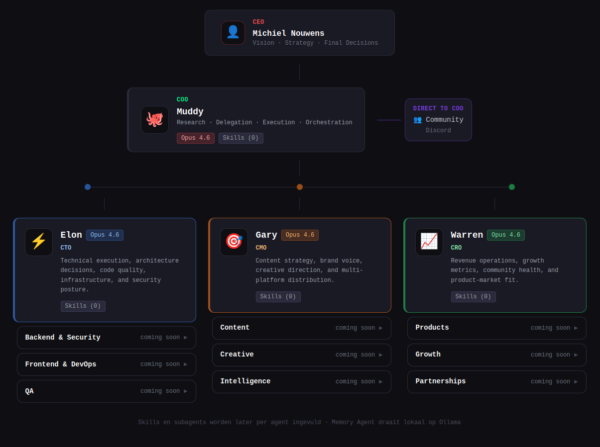

<div align="center">

# Openclaw Sandbox

**A hypervisor-isolated command center for a corporate AI executive team — controlled entirely from Discord.**

*Built on [Openclaw](https://github.com/openclaw/openclaw) + [NixOS MicroVM](https://github.com/astro/microvm.nix). Declarative, reproducible, and small enough to understand.*

---

[](https://github.com/astro/microvm.nix)
[](https://github.com/cloud-hypervisor/cloud-hypervisor)
[](https://discord.com)
[](https://claude.ai)
[](LICENSE)

</div>

---

## Why This Exists

[Openclaw](https://github.com/openclaw/openclaw) is a powerful multi-agent AI platform — but it's a complex Node.js application with full system access. Running it directly on your host means trusting a large, opaque codebase with your files, credentials, and network.

This sandbox wraps Openclaw in a **NixOS MicroVM** with **cloud-hypervisor** — giving you true hypervisor-level isolation. The agent can't touch your host. It can only see what you explicitly share via virtiofs. Everything is declarative: one `flake.nix` defines the entire environment, reproducibly.

The result: Openclaw's full multi-agent power — a corporate executive team (COO, CTO, CMO, CRO) — without compromising your host system.

> **Looking for a simpler single-agent setup?**
> See [nanoclaw-sandbox](https://github.com/nouwnow/nanoclaw-sandbox) — the same hypervisor isolation pattern for a lightweight Telegram bot.

---

## What You Get

<div align="center">

<p><em>Mission Control — your AI executive team. Muddy (COO) runs the operation from Discord, delegating to Elon (CTO), Gary (CMO) and Warren (CRO). Live pixel art shows who's working, resting, or in a meeting.</em></p>
</div>

---

**One Discord bot. A full AI executive team behind it.**

```
You (Discord)
    │
    ▼
Muddy 🐙 — COO (coordinator, always available)
    ├── Elon  ⚡ CTO  → technical architecture, infrastructure, security
    ├── Gary  🎯 CMO  → content strategy, brand voice, creative direction
    ├── Warren 📈 CRO → revenue operations, growth metrics, partnerships
    └── Memory Agent 🧠 → long-term memory storage and retrieval
         │
         ▼
    ~/openclaw-workspace/content/
```

Muddy **always delegates** — staying available for you while the team executes. Add `"doe het nu"` at the end of any message to have Muddy handle it directly himself.

**From Discord:**
```
Muddy, laat Warren een concurrentieanalyse doen van onze markt
Muddy, vraag Gary om een welkomsttekst voor nieuwe gasten — warm en professioneel
Muddy, wat is onze sterkste USP voor zakelijke reizigers? doe het nu
Muddy, laat Elon de website auditen op laadtijd en SEO
```

---

## Architecture

```
Host (Linux)
└── NixOS MicroVM (cloud-hypervisor, 8GB RAM, 4 vCPU)
    ├── openclaw-gateway          (port 18789) ← main: Muddy (COO) + Elon + Gary + Warren + Memory Agent
    ├── openclaw-gateway-project-a (port 18790) ← project-a: coordinator-a (isolated workspace, geen Discord)
    ├── dashboard (Next.js)        (port 3333)  ← Mission Control web UI
    └── virtiofs mounts
        ├── /nix/store        → host Nix store (read-only)
        └── /home/agent/workspace → ~/openclaw-workspace (read-write, persistent)
```

**Multi-gateway routing:**
```
Discord / Mission Control
          │
          ▼
┌──────────────────────────────────────────┐
│  MAIN GATEWAY  (:18789)                  │
│  Muddy 🐙 COO  ← Discord binding        │
│    ├── Elon  ⚡ CTO (sessions_spawn)    │
│    ├── Gary  🎯 CMO (sessions_spawn)    │
│    ├── Warren 📈 CRO (sessions_spawn)   │
│    └── Memory Agent 🧠 (sessions_spawn) │
└───────────────────┬──────────────────────┘
                    │ sessions_spawn (isolated tasks)
                    ▼
┌─────────────────────────┐
│  PROJECT-A  (:18790)    │  ← isolated context, own memory
│  coordinator-a          │
└─────────────────────────┘
```

**Isolation model:**
- The VM runs under cloud-hypervisor — hardware-level separation from the host
- The agent user (uid 1000) can only write to the virtiofs workspace
- No SSH, no host network access beyond the tap interface
- `/nix/store` is shared read-only — no redundant downloads, fast builds

**Declarative:** The entire VM — packages, services, users, mounts — is defined in `flake.nix`. Rebuild with `nix build`. Version-locked via `flake.lock`.

---

## Requirements

- **Host OS:** Linux (Ubuntu 22.04+ / Debian 12+ / NixOS)
- **RAM:** 12 GB minimum (VM uses 8 GB by default)
- **Disk:** 20 GB free
- **KVM:** required (`/dev/kvm` accessible)
- **Nix:** with flakes enabled
- **Accounts:** [Claude Code](https://claude.ai/product/claude-code) subscription (Pro or Max), Discord account

---

## Quick Start

```bash
# 1. Clone
git clone https://github.com/nouwnow/openclaw-sandbox
cd openclaw-sandbox

# 2. Install Nix (skip if already installed)
curl -L https://nixos.org/nix/install | sh
echo "experimental-features = nix-command flakes" >> ~/.config/nix/nix.conf

# 3. KVM access
sudo usermod -aG kvm $USER  # log out and back in

# 4. Workspace
mkdir -p ~/openclaw-workspace/{.claude,.npm-global,.openclaw/agents/main/agent,.openclaw/workspace,.openclaw/workspace-elon,.openclaw/workspace-gary,.openclaw/workspace-warren,.openclaw/workspace-memory-agent,.openclaw/cron,.openclaw-bundled-plugins,content/{articles,newsletters,research,scripts,other}}

# 5. Create disk image for writable Nix store overlay
truncate -s 4G nix-store-rw.img
nix-shell -p e2fsprogs --run "mkfs.ext4 nix-store-rw.img"

# 6. Build the VM
nix build  # first time: 10–30 min

# 7. Network
sudo ./setup-network.sh

# 8. Start
./result/bin/virtiofsd-run   # terminal 1 — keep open
./result/bin/microvm-run     # terminal 2 — login: agent / agent
```

Then follow [OPENCLAW-SETUP.md](OPENCLAW-SETUP.md) to configure Discord and Anthropic auth.

---

## Installation

<details>
<summary>⚙️ Steps 1–4: Host preparation</summary>

### Step 1 — Host dependencies

```bash
sudo apt update && sudo apt install -y git curl iptables qemu-utils acl e2fsprogs
```

### Step 2 — Install Nix

```bash
curl -L https://nixos.org/nix/install | sh
. ~/.nix-profile/etc/profile.d/nix.sh
```

Enable flakes:
```bash
mkdir -p ~/.config/nix
echo "experimental-features = nix-command flakes" >> ~/.config/nix/nix.conf
```

### Step 3 — KVM access

```bash
sudo usermod -aG kvm $USER
# Log out and back in, then verify:
id | grep kvm
```

### Step 4 — Check UID/GID

```bash
id
# uid=1000(yourname) ...
```

If your uid/gid is **not** 1000, edit `flake.nix`:
```nix
users.groups.agent.gid = <your-gid>;
users.users.agent.uid  = <your-uid>;
```

</details>

<details>
<summary>🖥️ Steps 5–9: Build and start the VM</summary>

### Step 5 — Create workspace

```bash
mkdir -p ~/openclaw-workspace/{.claude,.npm-global,.openclaw/agents/main/agent,.openclaw/workspace,.openclaw/workspace-elon,.openclaw/workspace-gary,.openclaw/workspace-warren,.openclaw/workspace-memory-agent,.openclaw/cron,.openclaw-bundled-plugins,content/{articles,newsletters,research,scripts,other}}
chmod 777 ~/openclaw-workspace
```

### Step 6 — Create disk image

```bash
cd ~/openclaw-sandbox
truncate -s 4G nix-store-rw.img
nix-shell -p e2fsprogs --run "mkfs.ext4 nix-store-rw.img"
```

> The image must be formatted as ext4, not just allocated. `truncate` alone is not enough.

### Step 7 — Build the VM

```bash
nix build
```

First build: 10–30 minutes. Produces `./result/bin/microvm-run` and `./result/bin/virtiofsd-run`.

### Step 8 — Configure network

```bash
sudo ./setup-network.sh
```

> **Cold boot note:** Network settings are lost on host reboot. Always run `sudo ./setup-network.sh` before starting the VM after a reboot. See [README — Persistent network](#-persistent-network) to make this permanent.

### Step 9 — Start the VM

```bash
./result/bin/virtiofsd-run   # terminal 1 — filesystem bridge (keep open)
./result/bin/microvm-run     # terminal 2 — VM console, login: agent / agent
```

</details>

<details>
<summary>🤖 Steps 10–15: Openclaw and Discord setup</summary>

See [OPENCLAW-SETUP.md](OPENCLAW-SETUP.md) for the full step-by-step configuration.

> **Critical:** Openclaw's Anthropic plugin does **not** read `CLAUDE_CODE_OAUTH_TOKEN` from `.env`. You must create `auth-profiles.json` separately. The Discord pairing code works without this — but the agent won't actually respond to questions until it's configured. See [OPENCLAW-SETUP.md Step 4](OPENCLAW-SETUP.md#stap-4--anthropic-auth-configureren-auth-profiles).

</details>

---

## Daily Use

### VM opstarten

```bash
# Terminal 1 — filesystem bridge (open laten)
./result/bin/virtiofsd-run

# Terminal 2 — VM console
./result/bin/microvm-run
# login: agent / agent
```

### Gateway status & logs

Je hebt twee gateways draaien. De **hoofdgateway** verwerkt Discord en het team. De **project-A gateway** is een aparte context op poort 18790.

```bash
# Hoofdgateway (Discord + Muddy + team)
sudo systemctl status openclaw-gateway
tail -f /tmp/openclaw-gateway.log

# Project-A gateway (aparte context, poort 18790)
sudo systemctl status openclaw-gateway-project-a
journalctl -u openclaw-gateway-project-a -f
```

### Gateways herstarten

```bash
sudo systemctl restart openclaw-gateway
sudo systemctl restart openclaw-gateway-project-a
```

### Dashboard

Het Mission Control dashboard draait als systemd service en is bereikbaar op poort 3000:

```bash
sudo systemctl status openclaw-dashboard
# Open in browser: http://10.0.1.2:3333
```

### Agentlogs live volgen

```bash
# Hoofdgateway — korte tail
tail -50 /tmp/openclaw-gateway.log

# Project-A — via journalctl
journalctl -u openclaw-gateway-project-a --since "1 hour ago"
```

---

## How the Filesystem Bridge Works

When you run `./result/bin/virtiofsd-run`, you're starting the bridge that makes your host directories available inside the VM — securely, without network overhead, at near-native speed. This section explains what those processes actually are, why there are more of them than you might expect, and why this design is a good fit for a multi-agent setup.

---

### The short answer: 18 processes is correct

Run `ps aux | grep virtiofsd` on the host and you'll see ~18 processes. That's not a bug or a memory leak. Each directory share runs as an independent, self-healing chain of three processes:

```
supervisord
  └── bash wrapper  (our custom virtiofsd.package script from flake.nix)
        └── virtiofsd binary  (the actual filesystem server, actively serving the VM)
```

With two VMs (openclaw + nanoclaw) each sharing four directories, that adds up:

```
openclaw VM:                          nanoclaw VM:
  supervisord                           supervisord
    ├── wrapper → virtiofsd  workspace    ├── wrapper → virtiofsd  workspace
    ├── wrapper → virtiofsd  .claude      ├── wrapper → virtiofsd  .claude
    ├── wrapper → virtiofsd  .npm-global  ├── wrapper → virtiofsd  .npm-global
    └── wrapper → virtiofsd  /nix/store   └── wrapper → virtiofsd  /nix/store
──────────────────────────────────────────────────────────────────────────────
2 supervisord  +  8 bash wrappers  +  8 virtiofsd binaries  =  18 processes
```

In `ps aux` output, the bash wrappers show state `S` (sleeping — waiting for their child to exit) and the virtiofsd binaries show `Sl` (actively serving, multi-threaded).

---

### Why three layers instead of one?

Each layer has a specific job:

| Layer | Process | Job |
|---|---|---|
| **supervisord** | Python process manager | Keeps the bash wrapper alive. If the wrapper crashes hard, supervisord restarts it. |
| **bash wrapper** | Our custom script in `flake.nix` | Filters out `--posix-acl` (incompatible with our virtiofsd version) and runs a restart loop for clean VM reboots. |
| **virtiofsd binary** | The real filesystem server | Serves a single directory share to the VM over a Unix socket. One per share. |

The bash wrapper exists because `microvm.nix` always passes `--posix-acl` when launching virtiofsd — a flag our virtiofsd version doesn't support, causing an immediate crash. Rather than patch microvm.nix, we replace the virtiofsd binary with a shell script that silently drops that flag before forwarding everything else:

```bash
# flake.nix — virtiofsd.package (simplified)
for arg in "$@"; do
  case "$arg" in
    --posix-acl) ;;           # drop silently
    *) args+=( "$arg" ) ;;
  esac
done
while true; do
  virtiofsd "${args[@]}" >> /dev/null 2>&1   # run the real binary
  sleep 1                                     # restart after clean exit (e.g. VM reboot)
done
```

The `while true` loop means that when the VM reboots cleanly, virtiofsd exits and immediately restarts — so the filesystem bridge is ready before the VM even finishes its boot sequence.

---

### Each share maps directly to agent responsibility

The four shares per VM aren't arbitrary. They correspond to the separation of concerns in the multi-agent architecture:

```
Host directory                 → VM mount point              → Used by
──────────────────────────────────────────────────────────────────────────────────────
~/openclaw-workspace           → /home/agent/workspace       → All agents — content,
                                                               openclaw.json, memory
~/openclaw-workspace/.claude   → /home/agent/.claude         → Claude Code auth only
~/openclaw-workspace/.npm-glob → /home/agent/.npm-global     → claude binary + packages
/nix/store                     → /nix/store  (read-only)     → All NixOS packages,
                                                               shared with host
```

**Why this separation matters for a multi-agent setup:**

Each virtiofsd process is an independent bridge. If the `workspace` process crashes during a heavy write operation (a researcher agent saving a large report), the `.claude` and `.npm-global` bridges are completely unaffected. The coordinator's authentication and tooling remain live. Only data access is interrupted — and it self-heals in under a second via the restart loop.

Contrast this with a single shared filesystem bridge: one crash takes down auth, tooling, and data simultaneously. For an orchestrator coordinating multiple parallel agents, that's a full pipeline outage.

```
Single bridge (fragile):
  workspace crash → coordinator loses auth → full pipeline down

Per-share bridges (resilient):
  workspace crash → workspace restarts in <1s → coordinator keeps running
  .claude intact  → auth unaffected
  .npm-global intact → claude binary unaffected
```

The `/nix/store` share is read-only and shared between both VMs and the host. No package is downloaded twice, and no agent can modify packages — the isolation boundary stays clean.

---

### The log bloat problem — and why it matters

> **If you've ever woken up to a full disk after leaving agents running overnight — this is why.**

By default, virtiofsd runs with `--log-level=debug`. In a single-VM setup with light use, this generates a few MB per hour. In an active multi-agent setup with cron jobs, a coordinator spawning sub-agents, and four virtiofsd processes per VM — it generates **gigabytes per hour**. Overnight: 50–90 GB is not unusual.

The log goes to `/tmp/vfs-<vmname>.log`, a file with no rotation and no size limit.

**The fix is two lines in `flake.nix`:**

```nix
virtiofsd.extraArgs = [ "--sandbox=none" "--log-level=error" ];

# In the bash wrapper:
virtiofsd "${args[@]}" >> /dev/null 2>&1   # ← not a file, /dev/null
```

`--log-level=error` drops all debug and info output at the source. `>> /dev/null` ensures nothing accumulates anywhere, even if something does slip through. In production, debug output from a filesystem server has zero operational value — errors are all that matter, and actual errors are rare enough to not need rotation.

---

### Verify your setup is clean

<details>
<summary><strong>Quick health check — run this after every <code>nix build</code></strong></summary>

```bash
# No process should have --log-level=debug
ps aux | grep virtiofsd | grep -v grep | grep "log-level=debug"
# Expected: empty

# Log files should not be growing
ls -lh /tmp/vfs-*.log && sleep 15 && ls -lh /tmp/vfs-*.log
# Expected: identical sizes both times

# Correct process count: 8 virtiofsd binaries (4 per VM)
ps aux | grep virtiofsd | grep -v grep | grep "log-level=error" | wc -l
# Expected: 8
```

</details>

<details>
<summary><strong>Stale debug processes after a failed rebuild</strong></summary>

After running `nix build` and restarting the runner, you may briefly have two sets of virtiofsd processes: the old ones (still `--log-level=debug`) and the new ones (`--log-level=error`). This happens when the old runner is still open in another terminal.

**Identify:**
```bash
ps aux | grep virtiofsd | grep -v grep | grep "log-level=debug"
```

**Fix — kill by PID:**
```bash
kill <pid1> <pid2> ...
```

supervisord immediately restarts the killed processes using the new configuration — within seconds you'll see fresh `--log-level=error` replacements. You don't need to restart the VM or the runner.

**After killing, verify:**
```bash
ps aux | grep virtiofsd | grep -v grep | grep "log-level=debug"
# Expected: empty
```

</details>

---

## Multi-Agent Pipeline

Openclaw 2026.3.x has full native multi-agent support:

- **Agent bindings** — route Discord channels or DMs to specific agents
- **Subagent spawning** — Muddy (COO) spawns Elon/Gary/Warren as `run`-mode tasks via `sessions_spawn`
- **Discord thread binding** — each sub-agent automatically gets its own Discord thread via `registerDiscordSubagentHooks`
- **Live control** — `/subagents list`, `/steer <n> <msg>`, `/kill <n>`, `/log <n>` from Discord
- **Parallel broadcasting** — send one message to multiple agents simultaneously

To configure the pipeline, use Claude Code inside the VM:
```bash
cd ~/workspace && claude
```

The executive team is configured in `openclaw.json`:
```json
{
  "agents": {
    "list": [
      { "id": "muddy",        "default": true },
      { "id": "elon" },
      { "id": "gary" },
      { "id": "warren" },
      { "id": "memory-agent" }
    ]
  },
  "channels": {
    "discord": {
      "enabled": true,
      "bindings": [{ "agentId": "muddy" }]
    }
  }
}
```

Only Muddy is bound to Discord. The others are spawned by Muddy internally.

---

## The Executive Team

Each agent has its own workspace directory with identity files that define who they are and how they work.

### Workspace structure per agent

```
~/openclaw-workspace/.openclaw/
├── workspace/           ← Muddy (COO) — shared team workspace
│   ├── SOUL.md          ← who Muddy is, business mission
│   ├── USER.md          ← Michiel's profile + company context
│   ├── AGENTS.md        ← delegation rules, team overview, meeting protocols
│   ├── TOOLS.md         ← available tools, Discord channel IDs, file paths
│   ├── HEARTBEAT.md     ← periodic checklist (check tasks.json, C-Suite Chat)
│   ├── c-suite-chat.jsonl  ← async team communication log
│   ├── tasks.json       ← task queue for autonomous processing
│   ├── standups.json    ← executive meeting archive
│   └── projects.json    ← gateway registry for Mission Control
├── workspace-elon/      ← Elon (CTO)
│   ├── SOUL.md / USER.md / AGENTS.md / TOOLS.md / HEARTBEAT.md
├── workspace-gary/      ← Gary (CMO)
│   ├── SOUL.md / USER.md / AGENTS.md / TOOLS.md / HEARTBEAT.md
├── workspace-warren/    ← Warren (CRO)
│   ├── SOUL.md / USER.md / AGENTS.md / TOOLS.md / HEARTBEAT.md
└── workspace-memory-agent/
    └── AGENTS.md        ← memory storage/retrieval instructions
```

### Setting up a new team

1. **Configure `openclaw.json`** — list all agents, bind one to Discord:
```json
{
  "agents": {
    "list": [
      { "id": "muddy", "default": true },
      { "id": "elon" }, { "id": "gary" }, { "id": "warren" },
      { "id": "memory-agent" }
    ]
  }
}
```

2. **Create workspace directories** (already included in the Quick Start `mkdir -p` command)

3. **Write identity files per agent** — at minimum `SOUL.md` (who are you?) and `AGENTS.md` (how do you work?). The faster path: use Claude Code to generate them from your business context:
```
Generate SOUL.md and AGENTS.md for an agent named "elon" — CTO role —
based on this company description: [paste your context]
```

4. **Register in `projects.json`** — add the `"agents"` array to show the correct team in Mission Control (otherwise it scans the filesystem and may show old agent directories):
```json
{
  "projects": [{
    "id": "main",
    "agents": ["muddy", "elon", "gary", "warren", "memory-agent"]
  }]
}
```

5. **Set the delegation trigger** — configure Muddy's AGENTS.md with the rules for when he delegates vs. executes himself. See [Inter-Agent Communication](#inter-agent-communication) below.

---

## Browser Tool & WordPress Integration

Each agent can interact with the WordPress staging site (`www.logiesopdreef.nl`) using three complementary tools: the OpenClaw managed browser, the WordPress REST API, and the WooCommerce/Matomo APIs. All actions go through the **staging site only** — production is never touched.

### Tool selection per task type

| Task | Tool |
|------|------|
| Visual page check, layout review | OpenClaw managed browser (headless Chromium) |
| Read/create/update posts (draft) | WordPress REST API |
| Bookings, orders, customers | WooCommerce REST API |
| Analytics, traffic, conversions | Matomo API |

### OpenClaw browser configuration

The browser tool is configured in `openclaw.json` with a managed `openclaw` profile (headless Chromium, CDP port 18800) and SSRF policy set to allow the private `10.0.1.1` network. The staging site uses a self-signed cert — `--ignore-certificate-errors` is passed automatically.

```json
"browser": {
  "enabled": true,
  "defaultProfile": "openclaw",
  "headless": true,
  "executablePath": "/run/current-system/sw/bin/chromium",
  "extraArgs": ["--ignore-certificate-errors"],
  "ssrfPolicy": { "dangerouslyAllowPrivateNetwork": true },
  "profiles": {
    "openclaw": { "cdpPort": 18800, "color": "#FF4500" }
  }
}
```

A persistent WordPress login is saved as Playwright storageState in `.openclaw/wp-staging-auth.json`. This file is generated once on the host using `wp-login.mjs` (requires Playwright — NixOS VMs can't run dynamically linked binaries).

### NixOS-specific setup

- `chromium` added to `environment.systemPackages` in `flake.nix` (provides the binary path agents need)
- `networking.hosts = { "10.0.1.1" = [ "www.logiesopdreef.nl" ]; }` in `flake.nix` (VM DNS resolution to host)
- No socat or port forwarding needed — Local WP already binds ports 80/443 on `0.0.0.0`

### Agent domain boundaries

| Agent | WordPress domain | Read freely | Needs approval |
|-------|-----------------|-------------|----------------|
| **Elon** (CTO) | Technical: plugins, themes, performance | WP settings, error logs, plugin status | Plugin installs, PHP/server changes |
| **Gary** (CMO) | Content: posts, pages, media, SEO | Posts, pages, media library | Create/publish posts, SEO metadata changes |
| **Warren** (CRO) | Data: bookings, customers, analytics | Orders, customers, Matomo stats | Change bookings, modify pricing, create vouchers |

All agents write content as `draft` first — never direct `publish` without Michiel's approval.

See [PRD-v4-browser-usage.md](PRD-v4-browser-usage.md) for full browser architecture, tool selection rules, and setup checklists.

---

## Lab Decision Board

The **Lab Decision Board** is the approval workflow between agents and Michiel. Agents propose changes; Michiel approves them from the Mission Control dashboard before execution.

### Workflow

```
Agent proposes → [proposed]
Michiel approves → [in_progress]  (gateway notification sent to Muddy)
Agent executes → [review]
Michiel reviews → [done]

If blocked: [blocked] with reason
If rejected: [cancelled] with feedback
```

### Task schema (`agent-tasks.json`)

```json
{
  "id": "<uuid>",
  "status": "proposed",
  "priority": "high|medium|low",
  "title": "Korte omschrijving",
  "description": "Wat gevonden / wil aanpassen en waarom",
  "plan": "Welke data, welke actie, wat het effect is",
  "agent": "gary",
  "category": "wordpress",
  "createdAt": "2026-03-23T10:00:00Z"
}
```

Tasks are stored in `~/.openclaw/agent-tasks.json`. Each status transition sends a gateway notification to Muddy via `sessions.send`, so the agent team is always informed.

### Lab tab in Mission Control

The `🧪 Lab` tab in the dashboard shows all pending decisions in four sections:

- **NEEDS YOUR DECISION** — proposed tasks waiting for approval
- **BLOCKED ON YOU** — tasks where the agent needs input before proceeding
- **READY FOR REVIEW** — completed tasks waiting for Michiel's sign-off
- **IN PROGRESS** — tasks currently being executed

Filter by agent (elon/gary/warren) and priority (high/medium/low). Collapsible history shows done and cancelled tasks.

---

## Inter-Agent Communication

Muddy has three ways to communicate with the team. Each has a specific use case.

### 1. `sessions_spawn` — delegate a task (fire & forget)

Use this to start a task with a specific agent. The agent works independently; the result comes back automatically when done.

```javascript
sessions_spawn({
  agentId: "gary",          // elon | gary | warren | memory-agent
  task: "Schrijf een welkomsttekst voor nieuwe gasten — warm en professioneel",
  mode: "run",              // "run" = one-off task (default)
  thread: true              // true = progress visible in Discord thread
})
```

**`thread: true` vs omitting:**
| Situation | Use |
|-----------|-----|
| Longer task, Michiel wants to see progress | `thread: true` |
| Quick background task | omit |

**After spawning: do NOT poll.** Sub-agents report back automatically. Only send the final reply when all completions have arrived.

### 2. `sessions_send` — message to active session

Use this when an agent is already active (existing session) and you want to send a follow-up without starting a new spawn. Use `sessions_list` to see active sessions.

```javascript
sessions_send({
  sessionKey: "elon",
  message: "Elon, voeg ook mobiele laadtijd toe aan de audit.",
  timeoutSeconds: 0         // 0 = fire-and-forget
})
```

**`sessions_send` vs `sessions_spawn`:**
- Agent has an open session → `sessions_send`
- No active session or isolated task needed → `sessions_spawn`

### 3. C-Suite Chat — shared async channel

A shared JSONL log for the entire executive team. Write here for status updates, decisions, or notes that don't require immediate action.

**File:** `~/openclaw-workspace/.openclaw/workspace/c-suite-chat.jsonl`

**Format (one JSON object per line, always append):**
```json
{"ts":"2026-03-23T10:00:00Z","from":"muddy","to":"all","message":"Standup gepland voor morgen 09:00."}
{"ts":"2026-03-23T10:05:00Z","from":"warren","to":"all","message":"Concurrentieanalyse klaar. Rapport: content/research/analyse.md"}
```

**`to` options:** `"all"` for everyone, or specific agentId (`"elon"`, `"gary"`, `"warren"`, `"michiel"`)

Agents read the last lines at session startup for team context. Always append to the end, never overwrite.

### 4. Delegation rule — the "doe het nu" trigger

Muddy's AGENTS.md configures two modes:

| Message from Michiel | Muddy's behavior |
|----------------------|-----------------|
| `"Schrijf een samenvatting van onze B&B"` | Delegates to Gary |
| `"Schrijf een samenvatting van onze B&B, doe het nu"` | Muddy executes himself |

**Rule:** Muddy always delegates — staying available for you while the team executes. Only when a message ends with the exact words `"doe het nu"` does Muddy execute the task himself without delegating.

Configure this in `workspace/AGENTS.md`:
```
## Delegatieregel

- Muddy delegeert ALLES aan elon, gary, warren of memory-agent
- Uitzondering: als het bericht eindigt met "doe het nu" → Muddy voert zelf uit
- Bij delegeren: schrijf GEEN eigen versie eerst. Zeg alleen wat je delegeert aan wie.
```

### 5. Executive Standups — automated meeting cadence

Two recurring meetings are pre-configured in `cron/jobs.json`:

| Meeting | Schedule | Tags |
|---------|----------|------|
| Daily Executive Sync | Mon–Fri 08:30 Amsterdam | `daily` |
| Weekly Planning | Sunday 09:30 Amsterdam | `weekly`, `planning` |

Each meeting runs 3 rounds: status → discussion → decisions. The transcript is saved to `standups.json` and a summary is sent to Discord `#daily-digest`.

Tasks assigned during discussions are visible in `tasks.json` and processed by the hourly `task-checker` cron job.

---

## Hybride Memory & Multi-Project Orchestratie

> **Voor nieuwe gebruikers:** De standaard Openclaw-setup werkt direct en is krachtig genoeg voor de meeste use cases. De hybride memory-uitbreiding en multi-project architectuur beschreven in deze sectie zijn **gevorderd** — ze voegen significant waarde toe als je setup groeit, maar zijn niet vereist om te starten.

### Het probleem met de standaard setup

Openclaw werkt standaard met één grote memory-file (`MEMORY.md`) die bij elke sessie volledig in de context van de agent wordt geladen. Dit werkt prima voor kleine projecten, maar wordt problematisch naarmate het systeem groeit:

| Probleem | Gevolg |
|---|---|
| Alle context altijd aanwezig | Hoge tokenkosten, zelfs voor eenvoudige taken |
| Geen projectisolatie | Agent van project A "weet" alles over project B |
| Memory groeit ongecontroleerd | Agent raakt verward door irrelevante oude informatie |
| Één gateway voor alles | Downtime of herstart van één agent beïnvloedt alle projecten |

**Concreet voorbeeld van context-vervuiling:**
Je hebt een contentproject (artikelen schrijven) en een administratieproject (facturen verwerken). Zonder isolatie krijgt de schrijver-agent informatie over BTW-tarieven mee wanneer hij een artikel schrijft, en de administratie-agent leest schrijfstijlgidsen terwijl hij facturen verwerkt. Dit kost tokens en verwarrt de agent.

---

### De hybride oplossing — 4 methoden gecombineerd

We hebben vier complementaire memory-methoden geïmplementeerd die samen de standaard setup volledig vervangen:

| Methode | Type | Status | Waarde |
|---|---|---|---|
| **Folders** — `memory/projects/`, `memory/preferences/` | Markdown bestanden | ✅ Actief | Transparant, altijd beschikbaar bij sessie-start |
| **Native Memory Search** — `agents.defaults.memorySearch` | Semantische zoekopdracht via Gemini/OpenAI/Voyage embeddings | ✅ Actief | Agent zoekt zelf relevante context op via `memory_search` tool |
| **Extractie-cron** — dagelijks 23:00 | Automatische samenvatting van sessie-logs | ✅ Actief | Geen handwerk — dagelijkse feiten worden automatisch opgeslagen |
| **Facts DB** — `memory/facts.db` (SQLite) | Gestructureerde opslag voor feiten en content | ✅ Actief | Exacte queries: "welke artikelen zijn gepubliceerd?" |

De native memory search vereist een embedding API key (`GEMINI_API_KEY`, `OPENAI_API_KEY` of `VOYAGE_API_KEY`) in `.env` en deze config in `openclaw.json`:

```json
{
  "agents": {
    "defaults": {
      "memorySearch": {
        "enabled": true,
        "provider": "gemini"
      }
    }
  }
}
```

> **Belangrijk:** Configureer `memorySearch` onder `agents.defaults`, **niet** als top-level `memory.search` key — dat is een onbekende key in openclaw 2.x en laat de gateway crashen.

---

### Multi-project gateways — wanneer aanmaken?

**Maak een nieuw project aan wanneer:**

- Je twee of meer **fundamenteel verschillende domeinen** beheert (content schrijven vs. administratie)
- Je wil dat agents **nooit context delen** tussen projecten
- Je projecten onafhankelijk wil kunnen **herstarten, debuggen of uitschakelen**
- Één project veel zwaardere workloads heeft dan een ander

**Niet nodig wanneer:**
- Je meerdere taken binnen hetzelfde domein uitvoert (vijf verschillende soorten artikelen schrijven)
- Je agents onderling samenwerken aan één eindresultaat
- Je net begint — start met één gateway en splits later

**Voorbeeld waarbij projectisolatie cruciaal is:**

```
Zonder isolatie:
  Schrijver-agent ontvangt vraag: "schrijf een artikel over duurzaamheid"
  → Laadt ook context: klantfacturen, BTW-tarieven, contactgegevens
  → Hoge tokenkosten, kans op informatie-lekken, verward antwoord

Met isolatie:
  Project "content" gateway (:18790):
    → Laadt alleen: schrijfstijl, contentarchief, onderzoeksnotities
  Project "admin" gateway (:18791):
    → Laadt alleen: klantdata, factuurformaten, BTW-regels
  Orchestrator (:18789):
    → Weet van beide projecten, stuurt taakopdracht door zonder context mee te sturen
```

---

### Implementatiestappen

De volledige implementatie is uitgewerkt in **[PRD-v2-orchestrator-memory.md](PRD-v2-orchestrator-memory.md)** met 6 fases, acceptatiecriteria en exacte commando's. Samenvatting:

**Fase 1 — Memory Folders** *(15 min)*
```bash
mkdir -p .openclaw/workspace/memory/{projects,preferences}
touch .openclaw/workspace/memory/projects/{goals,decisions}.md
touch .openclaw/workspace/memory/preferences/{writing-style,tools}.md
# Voeg Memory Update Protocol toe aan AGENTS.md
```

**Fase 2 — Facts DB** *(10 min, via Claude in VM)*
```
Maak facts.db aan in .openclaw/workspace/memory/ met tabellen:
research_facts (id, topic, fact, source, confidence, created_at)
content_pieces (id, title, type, status, path, created_at, agent)
```

**Fase 3 — Extractie-cron** *(5 min)*
Voeg een cron job toe aan `jobs.json` die elke avond om 23:00 sessie-logs leest en `memory/YYYY-MM-DD.md` schrijft.

**Fase 4 — Native Memory Search** *(5 min)*
Voeg embedding API key toe aan `.env` en `memorySearch` config toe aan `openclaw.json` onder `agents.defaults`.

**Fase 5 — Project Gateway** *(30 min, vereist VM rebuild)*
Voeg `systemd.services.openclaw-gateway-project-a` toe aan `flake.nix` met eigen `stateDir` en poort. Zet `channels.discord.enabled: false` in `project-a/openclaw.json` — project-a wordt aangestuurd via `agentTurn` door de hoofdcoordinator, niet direct vanuit Discord. Beide gateways op dezelfde Discord bot token veroorzaken dubbele responses.

**Fase 6 — MEM0 Plugin** *(optioneel)*
Installeer de `mem0-openclaw-mem0` plugin via de Openclaw marketplace voor volledig automatische conversatie-memory injectie.

---

### Context-isolatie in de praktijk

De orchestrator delegeert taken naar project-gateways met **minimale context** — alleen de taakomschrijving, het gewenste output-formaat, en het doelkanaal. Nooit project-specifieke bestanden of eerdere gesprekken:

```
Orchestrator stuurt naar Project-A:
  ✓ "Schrijf een artikel over zonnepanelen, max 800 woorden, voor #articles kanaal"
  ✗ Klantdata uit project B
  ✗ Gesprekslogs van de afgelopen week
  ✗ Memory bestanden van andere projecten
```

Dit betekent dat een herstart van Project-A's gateway nooit invloed heeft op de orchestrator of Project-B.

---

A fully local Next.js dashboard running inside the VM, accessible from your host browser at `http://10.0.1.2:3333`. No cloud, no external services — everything streams directly from Openclaw gateways over WebSocket and SSE.

```
Host browser  →  http://10.0.1.2:3333
                      │
              Next.js (in VM, port 3333)
                      │  WebSocket + SSE
              ┌────────────────────────┐
              │ Orchestrator  :18789   │
              │ Project-A     :18790   │  ← switchable via Projects tab
              └────────────────────────┘
```

The dashboard has **six tabs**, each auto-refreshing from live gateway events:

### Tab 1 — Dashboard

Real-time overview of everything happening right now:

- **Agents panel** — all configured agents with name and session count
- **Active sessions** — open conversations per agent with token usage and age
- **Task backlog** — all queued, running, and completed tasks; create new tasks via the form
- **Live feed** — raw gateway push events streamed via SSE as they arrive
- **Stats bar** — pending / running count and active session count at a glance

Sessions and agents refresh every 5 minutes. The live feed updates instantly via SSE.

### Tab 2 — 🏢 Office (Pixel Art)

A 2D pixel art simulation rendered on an HTML5 Canvas. Characters react to live gateway events in real time:

| Agent state | Trigger | Animation |
|---|---|---|
| Walking to desk | `agent lifecycle: phase=start` | Character moves toward its assigned desk |
| Typing at desk | Arrived at desk | Hands-on-keyboard animation, green dot |
| Speech bubble | `chat delta` event | What the agent is writing appears above its head |
| Walking to pool | `agent lifecycle: phase=end` | Character moves to pool to rest |
| Resting | At pool | Floating arm animation, blue dot |
| Error | `phase=error` | Red `!` above head, 3-second error state |
| Idle wandering | No active session | Character roams between zones |

**Gateway selector** — switch between Orchestrator and Project-A in the top bar. Each gateway shows its own agents with dynamic desk positions. Switching reconnects the SSE feed to the selected gateway. Offline gateways show a warning banner.

### Tab 3 — Projects

Overview of all configured gateways:

- **Gateway cards** — Orchestrator and all project gateways with live online/offline status (TCP port check every 30s)
- **Agent grid** — which agents exist per gateway, with their assigned color
- **Stats** — session count, port, stateDir path
- **Memory status** — shows whether memory folders and facts.db are present per gateway
- **Registry** — add new gateways by editing `.openclaw/workspace/projects.json` — no code changes needed

### Tab 4 — Calendar (Scheduled Tasks)

Visual weekly calendar for all cron jobs in `~/.openclaw/cron/jobs.json`:

- **Always Running** section — interval-based jobs (`kind: "every"`) as permanent badges
- **Weekly grid** — cron jobs plotted on the correct weekdays
- **Today highlight** — current day in red
- **Job detail modal** — agent, schedule, timezone, next/last run, error count, full prompt
- **Enable/disable** and **delete** from the modal
- **New schedule form** — create cron or interval jobs directly from the browser

The daily memory extraction cron (`memory-extractor`, runs 23:00) appears here automatically.

### Tab 5 — Memory

Three-panel memory viewer covering all four hybrid memory methods:

**🧠 Memory tab:**
- **Identity files** — `SOUL.md`, `USER.md`, `IDENTITY.md`, `HEARTBEAT.md`, `AGENTS.md`, `MEMORY.md` per agent with word count
- **Memory Folders** — collapsible categories: 🎯 Projects (`goals.md`, `decisions.md`), 🎨 Preferences (`writing-style.md`, `tools.md`), 📅 Daily Notes (auto-extracted by the 23:00 cron)
- Empty files show a placeholder — agents fill them as they work

**🗃 Facts tab:**
- **Research Facts** — browse all facts in `memory/facts.db` with topic filter chips, confidence badges (high/medium/low), and full-text search
- **Content Pieces** — all tracked content items with status (draft/review/published) and agent
- Searchable, filterable, live from SQLite via Python

**🗓 Journal tab:**
- All agent sessions grouped by date, newest first
- Days with an extracted memory note show ✅ badge and "extracted" label
- Green "Last extraction: YYYY-MM-DD" banner when extraction cron has run
- Click a day → see all sessions; click a session → full conversation view

**Global search** — type in the search bar (min. 2 chars) to search across all memory sources simultaneously: identity files, memory folders, facts DB, and daily notes. Results show source type, snippet with match highlighted in yellow, and click-to-open.

### Tab 6 — Docs

Document viewer for all files the agents have created:

- **Category filter chips** — `articles`, `newsletters`, `research`, `scripts`, `other`
- **Full-text search** — title, slug, agent, date
- **File list** — sorted by date, with category badge, size, word count
- **Rendered markdown** — headers, bold, lists, code, blockquotes

Agents save output to `~/workspace/content/{category}/YYYY-MM-DD_{agent}_{slug}.md`.

### Tab 7 — 🧪 Lab (Decision Board)

The Lab tab is Michiel's approval interface for all agent-proposed changes:

- **NEEDS YOUR DECISION** — proposed tasks waiting for approval (🚀 approve button)
- **BLOCKED ON YOU** — tasks paused, agent waiting for input
- **READY FOR REVIEW** — tasks completed by the agent, awaiting sign-off
- **IN PROGRESS** — tasks currently being executed
- **Filter** by agent (elon / gary / warren) and priority (high / medium / low)
- **Inline feedback** — add feedback before approving or rejecting
- **History** — collapsible done/cancelled log with delete button
- **Auto-refresh** every 30 seconds; each status change triggers a gateway notification to Muddy

---

### Setup

The dashboard is a Next.js app located in `~/workspace/dashboard/`. It is configured as a **systemd service** in `flake.nix` and starts automatically with the VM — no manual steps needed after a `nix build`.

**First-time setup (in the VM):**
```bash
cd ~/workspace/dashboard
npm install
```

**After `nix build` + VM restart:** the dashboard builds and starts automatically. Available at `http://10.0.1.2:3333`.

**Check status:**
```bash
sudo systemctl status openclaw-dashboard
sudo journalctl -u openclaw-dashboard -f
```

> **Build time:** the systemd service runs `npm run build` on every start/restart (~15–20 seconds). The dashboard is only available after the build completes.

**Manual restart:**
```bash
sudo systemctl restart openclaw-dashboard
```

---

### NixOS + VM Challenges and Solutions

Running a Next.js app inside a NixOS MicroVM requires solving several non-obvious problems. These are all already solved in this repo — documented here so you understand why the config looks the way it does.

<details>
<summary><strong>1. systemd service fails with <code>spawn sh ENOENT</code></strong></summary>

**Problem:** `npm run build` in a systemd service immediately fails. `npm` runs scripts by invoking `sh` internally, but NixOS systemd services get a minimal `PATH` with no `/bin/sh`.

**Solution:** Add `path = [ pkgs.bash pkgs.nodejs_20 pkgs.coreutils ]` to the service definition in `flake.nix`. This puts bash, node, and standard tools in the service's `PATH`.

```nix
systemd.services.openclaw-dashboard = {
  path = [ pkgs.bash pkgs.nodejs_20 pkgs.coreutils ];
  ...
};
```

</details>

<details>
<summary><strong>2. Firewall blocks port 3333 — browser can't connect</strong></summary>

**Problem:** The Next.js server binds on `0.0.0.0:3333` inside the VM, but the NixOS firewall drops incoming packets from the host. `http://10.0.1.2:3333` times out in the browser.

**Solution:** Add port 3333 to `networking.firewall.allowedTCPPorts` in `flake.nix`. Already done.

**Quick fix without rebuild:**
```bash
sudo iptables -I INPUT -p tcp --dport 3333 -j ACCEPT
```

</details>

<details>
<summary><strong>3. Gateway WebSocket protocol — 8 non-obvious requirements</strong></summary>

The Openclaw gateway uses a custom WebSocket protocol. None of this is documented publicly — it was reverse-engineered from the minified source in the Nix store.

| Requirement | What happens if you get it wrong |
|---|---|
| Wait for `connect.challenge` before sending `connect` | Gateway closes silently |
| Include `"type": "req"` in every request frame | `1008 invalid request frame` |
| Use `client.id = "openclaw-control-ui"` | All scopes are cleared → `missing scope: operator.read` |
| Include `Origin: http://127.0.0.1:3333` header | `origin missing or invalid` |
| Set `dangerouslyDisableDeviceAuth: true` in `openclaw.json` | Ed25519 keypair required → connection refused |
| Auth is plain token: `auth: { token: "..." }` | Trying HMAC causes auth failure |
| Response data is in `payload`, not `result` | Silent empty responses |
| `agents.list` / `sessions.list` return wrapper objects | Panels show 0 items despite 200 OK |

All of these are solved in `src/lib/gateway.ts`.

</details>

<details>
<summary><strong>4. <code>tasks.list</code> does not exist in the gateway</strong></summary>

**Problem:** The gateway has no `tasks.list` RPC method. Calling it returns `unknown method: tasks.list`.

**Solution:** Tasks are stored locally in `~/.openclaw/tasks.json` and read/written directly by the Next.js API routes — no gateway needed.

</details>

<details>
<summary><strong>5. <code>ws</code> package requires <code>serverExternalPackages</code></strong></summary>

**Problem:** Next.js on Node.js 20+ tries to bundle the `ws` WebSocket package. This breaks at runtime with `bufferutil.mask is not a function`.

**Solution:** Add to `next.config.js`:
```js
serverExternalPackages: ['ws', 'bufferutil', 'utf-8-validate']
```

</details>

<details>
<summary><strong>6. Agent memory is UUID-based, not date-based</strong></summary>

**Problem:** Openclaw session files are named by UUID (`3759cfbe-....jsonl`), not by date. There is no `sessions.list` gateway method that returns dates.

**Solution:** The memory API reads the first line of each `.jsonl` file to extract the `timestamp` field, then groups sessions by date client-side.

</details>

---

### Gateway Push Events (for the Pixel Art Office)

The office simulation is driven by live WebSocket events. Key event types:

```javascript
// Agent starts working → walk to desk
{ event: 'agent', payload: { stream: 'lifecycle', data: { phase: 'start' }, sessionKey: 'agent:coordinator:...' }}

// Agent writing → speech bubble
{ event: 'agent', payload: { stream: 'assistant', data: { delta: '...', text: '...' }, sessionKey: '...' }}

// Agent done → walk to pool
{ event: 'agent', payload: { stream: 'lifecycle', data: { phase: 'end' }, sessionKey: '...' }}

// Cron job fired → coordinator goes to work
{ event: 'cron', payload: { action: 'started', jobId: '...' }}
```

Extract `agentId` from `sessionKey`: `'agent:coordinator:cron:...'` → `split(':')[1]` → `'coordinator'`

See [OPENCLAW-SETUP.md — Stap 9](OPENCLAW-SETUP.md) for the full gateway protocol reference.

---

## Configuration

### Resource scaling

```nix
# flake.nix
microvm = {
  mem  = 8192;   # 8 GB  — default
  # mem = 16384; # 16 GB — for heavy swarm pipelines
  vcpu = 4;
  # vcpu = 8;    # for parallel agent execution
};
```

### Mount additional directories

```nix
{ source = "/home/youruser/projects";
  mountPoint = "/home/agent/projects";
  tag = "projects";
  proto = "virtiofs"; }
```

### After `nix build` upgrades

The Nix store hash changes with each upgrade. Regenerate the plugin overlay:

```bash
# On the host:
~/openclaw-sandbox/build-plugin-overlay.sh

# Then in the VM:
sudo systemctl restart openclaw-gateway
```

---

## Persistent Network

After a host reboot, the tap interface is gone. To make it permanent:

**`/etc/systemd/network/10-vmtap1.netdev`:**
```ini
[NetDev]
Name=vmtap1
Kind=tap

[Tap]
User=youruser
```

**`/etc/systemd/network/10-vmtap1.network`:**
```ini
[Match]
Name=vmtap1

[Network]
Address=10.0.1.1/24
IPMasquerade=ipv4
IPForward=yes
```

```bash
sudo systemctl enable --now systemd-networkd
sudo systemctl restart systemd-networkd
```

---

## Project Structure

```
openclaw-sandbox/
├── flake.nix                     # Complete VM definition (gateways, dashboard, firewall)
├── flake.lock                    # Pinned dependency versions
├── setup-network.sh              # Host network setup (vmtap1 + NAT)
├── build-plugin-overlay.sh       # Rebuild plugin overlay after nix build upgrades
├── nix-store-rw.img              # Writable ext4 overlay for /nix/store in VM
├── README.md                     # This file
├── OPENCLAW-SETUP.md             # Openclaw + Discord + multi-agent setup guide
├── PRD-v2-orchestrator-memory.md # Full PRD: multi-project + hybrid memory (6 phases)
└── PRD-v4-browser-usage.md       # Full PRD: browser tool setup, WP integration, SSRF config

~/openclaw-workspace/             # Persistent state (virtiofs, survives VM reboots)
├── .claude/                      # Claude Code auth
├── .npm-global/                  # Global npm packages incl. claude binary
├── .env                          # Secrets: Discord token, API keys (Gemini/OpenAI)
├── .openclaw/                    # Main gateway state (port 18789)
│   ├── agents/*/sessions/        # JSONL session logs per agent
│   ├── cron/jobs.json            # Scheduled tasks (daily sync 08:30, weekly 09:30, task-checker, memory-extractor 23:00)
│   ├── wp-staging-auth.json      # Playwright storageState — persistent WP admin login
│   ├── wp-login.mjs              # One-time login script (run on host, generates auth.json)
│   ├── agent-tasks.json          # Lab Decision Board — proposed/in_progress/review/done tasks
│   ├── workspace/                # ← Muddy (COO) workspace + shared team files
│   │   ├── SOUL.md               # Muddy's identity and business mission
│   │   ├── USER.md               # Michiel's profile + company context
│   │   ├── AGENTS.md             # Delegation rules, team overview, WP routing rules
│   │   ├── TOOLS.md              # Available tools, Discord channel IDs, file paths
│   │   ├── HEARTBEAT.md          # Periodic checklist (check tasks.json, C-Suite Chat)
│   │   ├── c-suite-chat.jsonl    # Async team communication log (JSONL, append-only)
│   │   ├── tasks.json            # Task queue for autonomous processing
│   │   ├── standups.json         # Executive meeting archive
│   │   ├── projects.json         # Gateway registry + explicit agent list for Mission Control
│   │   └── memory/               # Hybrid memory store
│   │       ├── YYYY-MM-DD.md     # Daily extraction notes (auto-generated 23:00)
│   │       └── facts.db          # SQLite: research_facts + content_pieces
│   ├── workspace-elon/           # Elon (CTO) workspace
│   │   ├── SOUL.md / USER.md / AGENTS.md / TOOLS.md / HEARTBEAT.md
│   ├── workspace-gary/           # Gary (CMO) workspace
│   │   ├── SOUL.md / USER.md / AGENTS.md / TOOLS.md / HEARTBEAT.md
│   ├── workspace-warren/         # Warren (CRO) workspace
│   │   ├── SOUL.md / USER.md / AGENTS.md / TOOLS.md / HEARTBEAT.md
│   └── workspace-memory-agent/   # Memory agent workspace
│       └── AGENTS.md             # Memory storage/retrieval instructions
├── .openclaw-bundled-plugins/    # Plugin overlay (74 plugins, workaround for Nix)
├── content/                      # Agent output — files written by the team
│   ├── articles/                 # Blog posts, articles
│   ├── newsletters/              # Newsletters, digests
│   ├── research/                 # Research reports
│   ├── scripts/                  # Scripts, transcripts
│   └── other/                    # Other output
└── dashboard/                    # Mission Control (Next.js, port 3333)
    ├── src/app/                  # Pages: / /office /projects /schedules /memory /docs /standup /lab
    ├── src/app/lab/              # Lab Decision Board (proposed/blocked/review/done/cancelled)
    ├── src/app/api/feed/         # SSE stream with ?port= gateway selector
    ├── src/app/api/agent-tasks/  # Lab Decision Board CRUD + gateway notifications
    ├── src/app/api/projects/     # Gateway registry + live TCP port checks
    ├── src/app/api/memory/       # Sessions, markdown files, folder browser
    ├── src/app/api/memory/facts/ # SQLite facts.db via Python sqlite3
    ├── src/app/api/memory/search/# Full-text search across all memory sources
    ├── src/app/api/schedules/    # CRUD for cron jobs.json
    ├── src/app/api/standups/     # Executive standup CRUD (GET/POST/PATCH/DELETE)
    ├── src/app/api/docs/         # Content file browser
    └── src/lib/gateway.ts        # WebSocket client (challenge-response protocol)
```

---

## Model Optimalisatie & Token Efficiency

Dit systeem is geconfigureerd voor kostenefficiëntie op vier lagen: model tiering, prompt caching, compaction en toekomstige context-reductie via mem0. Deze sectie legt uit waarom dat nodig is, hoe het werkt, en welke keuzes er zijn gemaakt.

---

### Hoe tokens werken bij elke agent-aanroep

Elke keer dat een agent een bericht verwerkt, stuurt OpenClaw drie categorieën tokens naar de Anthropic API:

```
┌─────────────────────────────────────────────────────────────────────┐
│  Elke agent-beurt bestaat uit:                                      │
│                                                                     │
│  ┌─────────────────────────────────────────────┐                   │
│  │  SYSTEEM-PROMPT (vaste overhead per agent)  │  ← gecached ✅    │
│  │  SOUL.md + AGENTS.md + BOOTSTRAP.md         │                   │
│  │  Typisch: 5.000 – 50.000 tokens             │                   │
│  ├─────────────────────────────────────────────┤                   │
│  │  CONVERSATION HISTORY (groeit per sessie)   │  ← gecached ✅    │
│  │  Alle vorige berichten in deze sessie        │                   │
│  │  Kan groeien naar 100.000+ tokens            │                   │
│  ├─────────────────────────────────────────────┤                   │
│  │  NIEUW BERICHT (vers, elke beurt klein)      │  ← vers, betaald │
│  │  Jouw vraag of de nieuwe taak                │                   │
│  │  Typisch: 50 – 500 tokens                    │                   │
│  └─────────────────────────────────────────────┘                   │
└─────────────────────────────────────────────────────────────────────┘
```

**Praktisch voorbeeld** (zoals zichtbaar in de Mission Control Token Efficiency widget):

| Categorie | Tokens | Kosten (Sonnet) | Zonder cache |
|---|---|---|---|
| Input (vers) | 216 | $0.0006 | $0.0006 |
| Output | 9.600 | $0.1440 | $0.1440 |
| Cache read | 920.200 | $0.2761 | **$2.7606** |
| **Totaal** | | **$0.4207** | **$2.9052** |
| **Cache besparing** | | | **$2.49 (85%)** |

> **Cache hit rate 100%** betekent: bijna alle verwerkte tokens waren al gecached bij Anthropic. Alleen de nieuwe berichten worden vers betaald. Dit is automatisch actief via de Anthropic API — geen configuratie nodig.

---

### Prompt caching: automatisch, maar niet gratis

Anthropic's prompt caching slaat de eerste N tokens van een context op na de eerste aanroep. Daarna betaal je:

| Categorie | Prijs | Verhouding |
|---|---|---|
| Input (vers) | $3,00 / 1M tokens | 1× |
| Cache write | $3,75 / 1M tokens | 1,25× (eenmalig) |
| Cache read | $0,30 / 1M tokens | **10× goedkoper** |
| Output | $15,00 / 1M tokens | — |

Cache vervalt na ~5 minuten inactiviteit. Bij actieve sessies blijft de cache warm en profiteer je bij elke beurt. Bij cron jobs die elk uur draaien is de cache soms verlopen — die eerste beurt kost meer.

---

### Het groeiprobeem: conversation history

De systeem-prompt is stabiel. Maar de **conversation history** groeit elke sessie:

```
Sessie 1 (begin):    systeem 20k + history 0k   + bericht 0.2k  = 20.2k tokens
Sessie 50 (midden):  systeem 20k + history 80k  + bericht 0.2k  = 100.2k tokens
Sessie 200 (lang):   systeem 20k + history 300k + bericht 0.2k  = 320.2k tokens
```

Bij lange sessies betaal je cache-prijs over 300k+ tokens per beurt. Zonder oplossing groeit dit onbeperkt totdat de context overloopt.

**Huidige mitigatie:** `compaction.mode = safeguard` — OpenClaw comprimeert de history automatisch wanneer de context-limiet nadert. Dit voorkomt overflow maar lost het groeiprobeem niet fundamenteel op.

---

### Vier optimalisatielagen (geïmplementeerd)

#### Laag 1 — Prompt caching (automatisch ✅)
Altijd actief. Geen configuratie. Levert 85%+ kostenbesparing op de vaste overhead.

#### Laag 2 — Model tiering met Ollama escalatieladder (geconfigureerd ✅)

Niet elke taak vereist een cloud model. De escalatieladder — van goedkoop naar krachtig:

```
Tier 1 — Ollama (lokaal, gratis)
  └── editor, memory-agent → qwen3.5:9b op je eigen GPU
        │  als Ollama niet bereikbaar is:
        ▼
Tier 2 — Claude Haiku 4.5 (cloud fallback, ~4× goedkoper dan Sonnet)
        │  als de taak te complex is voor Haiku:
        ▼
Tier 3 — Claude Sonnet 4.6 (cloud, default)
  └── coordinator, writer, researcher
        │  als de taak onoplosbaar is voor Sonnet:
        ▼
Tier 4 — Claude Opus 4.6 (cloud, alleen bij expliciete escalatie)
  └── escalation-agent
```

De volledige agent-tier mapping:

| Agent | Model | Tier | Gebruik | Kosten |
|---|---|---|---|---|
| `memory-agent` | ollama/qwen3.5:9b | 1 | Memory extractie, cron-taken | **gratis** |
| *(Ollama offline)* | *claude-haiku-4-5* | *2* | *Automatische fallback* | *~4× goedkoper* |
| `muddy` | claude-sonnet-4-6 | 3 | Orchestratie, delegatie, planning | 1× (baseline) |
| `elon` | claude-sonnet-4-6 | 3 | Technische architectuur, infra, security | 1× |
| `gary` | claude-sonnet-4-6 | 3 | Content strategie, brand, creatief | 1× |
| `warren` | claude-sonnet-4-6 | 3 | Revenue, groei, community, partnerships | 1× |
| `escalation-agent` | claude-opus-4-6 | 4 | Alleen bij expliciete escalatie | 5× |

**Praktisch effect:** memory-agent verwerkt alle achtergrond-memory taken gratis op Ollama. De executive agents (Muddy/Elon/Gary/Warren) draaien op Sonnet — de coordinator overhead is laag omdat Muddy snel delegeert en zelf weinig uitvoert.

<details>
<summary><strong>Ollama instellen — vereisten en config</strong></summary>

**Vereisten:**
- Ollama draait op je host: `ollama serve` (standaard poort 11434)
- Model beschikbaar: `ollama pull qwen3.5:9b`
- Host bereikbaar vanuit de VM via de tap interface (standaard `10.0.1.1`)

**`.env` (in `~/openclaw-workspace/`):**
```bash
OLLAMA_API_KEY=ollama-local   # elke waarde, vereist om provider te registreren
```

**`openclaw.json` — relevante config:**
```json
{
  "agents": {
    "defaults": {
      "model": {
        "primary": "anthropic/claude-sonnet-4-6",
        "fallbacks": ["anthropic/claude-haiku-4-5-20251001"]
      }
    },
    "list": [
      { "id": "editor",       "model": "ollama/qwen3.5:9b" },
      { "id": "memory-agent", "model": "ollama/qwen3.5:9b" }
    ]
  },
  "models": {
    "providers": {
      "ollama": {
        "baseUrl": "http://10.0.1.1:11434",
        "models": [{ "id": "qwen3.5:9b", "name": "qwen3.5:9b" }]
      }
    }
  }
}
```

> **Let op:** Per-agent `model` moet een plain string zijn (`"ollama/qwen3.5:9b"`), geen object. Het `primary`/`fallbacks` object werkt alleen op `agents.defaults` niveau. Zie [Troubleshooting — per-agent model object](#) voor uitleg.

**Controleren of Ollama gebruikt wordt:**
```bash
# Op de host, tijdens een pipeline run:
nvtop   # GPU activity zichtbaar voor editor/memory-agent taken
```

</details>

De coordinator instrueert welke subagent een taak uitvoert. Simpele taken gaan naar Tier 1/2 (editor/memory-agent), complexe taken naar Tier 3 (writer/researcher), onoplosbare taken naar Tier 4 (escalation-agent).

#### Laag 3 — Compaction (geconfigureerd ✅)

Wanneer een sessie de context window nadert, compacteert OpenClaw automatisch de oudere history tot een samenvatting. Met expliciete config activeren we ook een `memoryFlush` — vlak voor compaction schrijft de agent duurzame herinneringen naar disk zodat niets verloren gaat.

```json
"compaction": {
  "mode": "safeguard",
  "identifierPolicy": "strict",
  "memoryFlush": {
    "enabled": true,
    "softThresholdTokens": 6000,
    "systemPrompt": "Session nearing compaction. Store durable memories now.",
    "prompt": "Write any lasting notes to memory/YYYY-MM-DD.md; reply with NO_REPLY if nothing to store."
  }
}
```

- `mode: safeguard` — beschermt cruciale context bij compaction, voorkomt informatieverlies
- `identifierPolicy: strict` — deployment IDs, ticket IDs en host:port-paren worden letterlijk bewaard in de samenvatting
- `memoryFlush` — stille extra turn vlak voor compaction zodat de memory-agent nog kan opschrijven wat belangrijk is

#### Laag 4 — Bootstrap limieten (geconfigureerd ✅)

OpenClaw laadt alle identity files (SOUL.md, AGENTS.md, etc.) als systeem-prompt bij elke sessie. Zonder limieten kan een groeiende AGENTS.md ongemerkt honderden tokens per beurt kosten.

```json
"agents": {
  "defaults": {
    "bootstrapMaxChars": 20000,
    "bootstrapTotalMaxChars": 80000
  }
}
```

- `bootstrapMaxChars` — maximale tekenlengte per individueel bestand
- `bootstrapTotalMaxChars` — gecombineerd maximum over alle bootstrap-bestanden

**Vuistregel:** `wc -m workspace/*.md` geeft tekencount. Deel door 4 voor een tokenschatting. De huidige AGENTS.md is ~6.000 tekens (±1.500 tokens) — ruim binnen de limiet.

> Limieten verhoogd van 12.000/40.000 naar 20.000/80.000 na analyse — de defaults zijn 20.000/150.000. Subagents ontvangen alleen AGENTS.md en TOOLS.md, de coordinator krijgt alle bootstrap-bestanden.

#### Laag 5 — Minimal promptmodus voor subagents (beschikbaar, bewust niet geïmplementeerd)

`promptMode: minimal` werkt in de huidige versie — de crashloop van v2026.3.14 is opgelost. Het verwijdert Skills, Memory Recall, Heartbeats, Messaging en Reply Tags uit de subagent system prompt.

| Modus | Bevat | Gebruik |
|---|---|---|
| `full` (default) | Skills, Memory Recall, Heartbeats, Messaging, Reply Tags | Coordinator — heeft alles nodig |
| `minimal` | Alleen taak-instructies en tools | Subagents — voeren één taak uit |

**Waarom niet geïmplementeerd:** `minimal` verwijdert de Skills-sectie waardoor subagents niet weten welke skills beschikbaar zijn en ze nooit laden. Dit blokkeert toekomstige uitbreiding van `writer`, `researcher` en `editor` met agent-specifieke skills. De `memory-agent` (enige kandidaat zonder skills) draait op Ollama — token-besparing is daar irrelevant.

**Heroverwegen als:** skills per subagent zijn uitgewerkt en duidelijk is welke agents nooit skills nodig hebben. Geschatte besparing: 20–40% minder tokens per subagent-aanroep.

> Zie [issue #2](https://github.com/nouwnow/openclaw-sandbox/issues/2) voor de volledige afweging.

#### Laag 6 — Dedicated agents per domein ✅

**Dit is de kern van het multi-agent ontwerp.** Eén grote coordinator met alles in zijn context is duurder en trager dan meerdere agents met kleinere, gefocuste contexten:

```
❌ Monolithisch (duur):
   Één agent weet alles: research + schrijven + geheugen + planning + techniek
   → 1 agent, 300k+ context, Sonnet-prijs voor alles

✅ Executive team (efficiënt):
   Muddy (COO):   orchestreert + delegeert (klein context, snel)
   Elon (CTO):    technische taken, eigen workspace-elon/AGENTS.md
   Gary (CMO):    content taken, eigen workspace-gary/AGENTS.md
   Warren (CRO):  revenue taken, eigen workspace-warren/AGENTS.md
   Memory-agent:  memory-taken op Ollama (gratis)
```

Elke agent heeft zijn eigen `workspace-{id}/AGENTS.md` met alleen de instructies die relevant zijn voor zijn rol. De overhead per agent is kleiner dan die van één alleskunner.

---

#### Laag 7 — Heartbeat model & interval (geconfigureerd ✅)

Heartbeats draaien nu op Haiku in plaats van Sonnet — 4× goedkoper per heartbeat-trigger.

```json
"heartbeat": {
  "every": "55m",
  "model": "anthropic/claude-haiku-4-5-20251001"
},
"models": {
  "anthropic/claude-sonnet-4-6": {
    "params": { "cacheRetention": "long" }
  }
}
```

- `model: haiku` — 4× goedkoper per heartbeat-trigger versus Sonnet
- `every: 55m` — afgestemd op de Anthropic prompt-cache TTL van 1 uur; heartbeat vlak voor expiry houdt de cache warm
- `cacheRetention: long` — activeert 1-uur cache TTL voor Sonnet; vereist `extended-cache-ttl-2025-04-11` beta flag (automatisch via OpenClaw)

> Let op: de parameter heet `every` (string, bijv. `"55m"`), niet `intervalMinutes`.

#### Laag 8 — Cron frequentie (geconfigureerd ✅)

Elke cron trigger start een nieuwe sessie met volledige context-injectie. Hoge frequentie = directe kostenvermeerdering.

| Job | Oud | Nieuw | Triggers/dag |
|---|---|---|---|
| `task-checker` | elke 5 min | elke 60 min | 288 → **24** (12× minder) |

De `elk-uur-statuscheck` en `dagelijkse-briefing` waren al op verstandige intervallen.

---

### Toekomstige optimalisaties

| Oplossing | Wat het doet | Status |
|---|---|---|
| **Ollama Tier 1** | Editor + memory-agent draaien lokaal op qwen3.5:9b — geen API-kosten | ✅ Geïmplementeerd |
| **Mem0 / native search** | Vervangt groeiende conversation history door gerichte retrieval | Configureerbaar (zie Memory sectie) |
| **AGENTS.md pruning** | Wekelijks verouderde instructies verwijderen, patronen naar SOUL.md promoveren | Handmatig onderhoud |
| **Shared KV-cache** | Anthropic werkt aan cache die tussen sessies blijft leven | Roadmap Anthropic |
| **Context distillation** | Agent vat zichzelf samen na elke sessie (uitbreiding op compaction) | Toekomstig |

**Wanneer mem0 helpt:** zodra je merkt dat de cache read tokens per sessie blijven groeien (zichtbaar in Mission Control Token Efficiency), is mem0 de volgende stap. In plaats van de volledige conversation history te cachen, haalt de agent alleen relevante facts op via `memory_search`. Dit houdt de context klein, ook na honderden sessies.

---

### Token Efficiency monitoren

De **Mission Control Dashboard** toont real-time tokenverbruik in de **Token Efficiency widget** (Tab 1):

- **Cache hit rate** — percentage cloud tokens dat gecached was (typisch 85–100%)
- **Input / Output / Cache** — absolute aantallen per periode
- **Est. cost** — geschatte kosten op basis van Anthropic's prijzen
- **Per-agent breakdown** — welke agent hoeveel verbruikt, met model-badge (geconfigureerd model)
- **Local vs Cloud split** — Ollama vs Anthropic volledig gesplitst, per agent, met besparingen

#### Per-agent breakdown

Elke agent toont zijn geconfigureerde model-badge — zo zie je in één oogopslag welke agents Anthropic gebruiken en welke lokaal draaien:

```
Per agent
memory-agent  in:31.8k  out:4.4k  cache:558.9k  [Ollama]   ← lokaal, gratis
editor        in:15.1k  out:3.8k  cache:25.9k   [Ollama]   ← lokaal, gratis
coordinator   in:629    out:90.3k  cache:5.86M   [S4.6]
researcher    in:43     out:13.7k  cache:386.5k  [S4.6]
writer        in:24     out:6.3k   cache:91.0k   [S4.6]
escalation-agent  in:0  out:0     cache:0        [O4.6]
```

#### Local vs Cloud — volledige opsplitsing

De Local vs Cloud sectie splitst alle activiteit nauwkeurig op in twee afzonderlijke tabellen:

```
⚡ Local 29%  ☁ Cloud 71%

☁ Cloud (Anthropic)                              $3.68
Cache hit rate  ████████████████████  100%
Input: 782    Output: 117.5k    Cache: 6.93M

  memory-agent  in:77    out:4.2k  cache:558.9k  [H4.5]   ← voorheen cloud
  editor        in:9     out:3.0k  cache:25.9k   [S4.6]   ← voorheen cloud
  coordinator   in:629   out:90.3k cache:5.86M   [S4.6]
  researcher    in:43    out:13.7k cache:386.5k  [S4.6]
  writer        in:24    out:6.3k  cache:91.0k   [S4.6]

⚡ Local (Ollama)                                 $0.00
Input: 46.9k    Output: 1.1k
Bespaard vs Haiku:  $0.04

  memory-agent  in:31.7k  out:221   [Q3.5]
  editor        in:15.1k  out:844   [Q3.5]
```

**Hoe je dit leest:**

- **Cloud tabel** — alleen Anthropic-tokens, met het Anthropic model dat historisch gebruikt werd per agent. Memory-agent en editor staan hier ook als ze ooit cloud hebben gedraaid (voor de migratie naar Ollama) — zo zie je de volledige history.
- **Local tabel** — alleen Ollama-tokens, alleen agents die daadwerkelijk lokaal hebben gedraaid. Badge toont het echte modelnaam (`Q3.5` voor `qwen3.5:9b`) in plaats van generiek "Ollama".
- **Bespaard vs Haiku** — wat dezelfde local tokens zouden hebben gekost als cloud fallback (Haiku-tarief). Dit is de meetbare besparing van het draaien op Ollama.

**Wat je ziet als Ollama actief is:**
- Local/Cloud split bar: hoe groter het groene deel, hoe meer lokaal werk er verzet werd
- Memory-agent en editor verdwijnen uit de Local tabel als ze niets hebben gedaan in de geselecteerde periode
- Ollama rapporteert geen cache tokens (geen prompt caching API) — dit is normaal; cache in de Cloud tabel zijn uitsluitend Anthropic cache reads

Als editor en memory-agent zwaar draaien (bulk content pipelines, intensieve cron jobs) zie je de Local share groeien en de "Bespaard vs Haiku" bedrag oplopen. Bij een grote pipeline (100k+ lokale tokens) kan dit al snel $0.10–$0.50 per run besparen.

---

## Lessons Learned

Things that will trip you up. All of these have been encountered and solved in this repo.

### 1. Cron jobs do NOT go in `openclaw.json`

The most common cause of gateway crash loops when setting up schedules.

**Wrong — gateway crashes with `Unrecognized key: "jobs"`:**
```json
{
  "cron": {
    "enabled": true,
    "jobs": [...]   ← THIS IS NOT VALID
  }
}
```

**Correct — jobs go in a separate file:**
```
~/openclaw-workspace/.openclaw/cron/jobs.json
```

The `cron` block in `openclaw.json` only accepts global settings (`enabled`, `maxConcurrentRuns`, `sessionRetention`). All jobs are defined in `cron/jobs.json`.

If the gateway is already in a crash loop:
```bash
tail -50 /tmp/openclaw-gateway.log   # ← find the error
# edit .openclaw/openclaw.json and remove the invalid key
sudo systemctl restart openclaw-gateway
```

---

### 2. Old agent directories intercept Discord messages

If you rename or replace your coordinator agent (e.g., `coordinator` → `muddy`), Discord messages will still go to the old agent if its session directory still exists.

**Why:** Openclaw routes new Discord messages to persisted sessions. An old `agents/coordinator/` directory with a saved Discord session (`agent:coordinator:discord:channel:...`) intercepts all messages — even after you update `bindings` in `openclaw.json`.

**Fix:** rename or archive the old agent directory:
```bash
mv .openclaw/agents/coordinator .openclaw/agents/coordinator_archived
sudo systemctl restart openclaw-gateway
```

**Verify:** check `journalctl -u openclaw-gateway -f` and send a test message on Discord. You should see the new agent responding, not the old one.

---

### 3. The Discord bot name comes from the Developer Portal, not your config

Changing an agent's display name in `SOUL.md` or `AGENTS.md` won't rename the bot in Discord. The bot's visible name (`OpenClaw Agent` or whatever it shows as) is set in the [Discord Developer Portal](https://discord.com/developers/applications) under your bot's settings.

Your AGENTS.md instructions ("you are Muddy") work — the agent identifies itself correctly in conversations. The Discord sidebar name is a separate platform setting.

---

### 4. Agent answers itself before delegating

When Muddy receives a task, he may write his own answer first and then spawn a subagent — defeating the purpose of delegation.

**Cause:** the instruction "delegate everything" needs to be explicit about the order of operations.

**Fix in `workspace/AGENTS.md`:**
```
Bij delegeren: schrijf GEEN eigen versie eerst.
Zeg alleen kort wat je doet en aan wie je delegeert.
Wacht op het resultaat van de subagent en stuur dat terug.

✅ Correct: "Dat is een taak voor Gary. Ik zet hem erop." → wacht → stuur Gary's resultaat
❌ Fout: eerst zelf een antwoord schrijven, daarna pas delegeren
```

---

### 5. The Office pixel art shows old agent names

If you replace agents (e.g., `coordinator` → team of 5), Mission Control's Office view may still show the old names because it scans the `agents/` filesystem directory.

**Fix:** add an explicit `agents` list to `workspace/projects.json`:
```json
{
  "projects": [{
    "id": "main",
    "name": "Logies op Dreef",
    "agents": ["muddy", "elon", "gary", "warren", "memory-agent"]
  }]
}
```

Also update the Projects API to use this list when present (already done in this repo):
```typescript
// src/app/api/projects/route.ts
const agents = p.agents ?? getAgents(p.stateDir)
```

---

### 6. Gateway log is at `/tmp/openclaw-gateway.log`

Not in `journalctl`. The systemd service redirects stdout/stderr to this file. When debugging crashes:
```bash
tail -50 /tmp/openclaw-gateway.log
```

`journalctl -u openclaw-gateway` only shows service start/stop events, not gateway errors.

---

### 8. Elke gateway heeft eigen auth per agent

Als je meerdere gateways draait (bijv. hoofdgateway + project-A gateway), heeft elke gateway zijn eigen `agents/` directory. Een agent die in één gateway een `auth-profiles.json` heeft, heeft dat **niet automatisch** in de andere gateway.

**Symptoom:** Discord-berichten geven een foutmelding zoals:
```
Agent failed before reply: No API key found for provider "anthropic".
Auth store: /home/agent/workspace/project-a/.openclaw/agents/muddy/agent/auth-profiles.json
```
Het antwoord komt toch nog — de hoofdgateway handelt het af na de mislukte poging — maar de foutmelding is zichtbaar in Discord.

**Wat er gebeurt:** wanneer Muddy (hoofdgateway) een bericht verwerkt, probeert hij ook een instantie op te starten in de project-A gateway voor cross-project coördinatie. Die instantie mist de auth.

**Fix:**
```bash
# Kopieer auth van hoofdgateway naar project-A gateway
cp /home/agent/workspace/.openclaw/agents/muddy/agent/auth-profiles.json \
   /home/agent/workspace/project-a/.openclaw/agents/muddy/agent/auth-profiles.json

# Herstart de project-A gateway (leest auth opnieuw in)
sudo systemctl restart openclaw-gateway-project-a
```

**Let op:** de project-A gateway cachet auth bij opstart. Alleen het kopiëren van het bestand is niet voldoende — een herstart is vereist.

---

### 9. Context7 is the fastest way to debug OpenClaw config

When you're not sure whether a config key exists or what it's called, use Context7 from inside the VM:
```bash
cd /home/agent/workspace && claude
# then ask: "use context7 — what are the valid keys under agents.defaults?"
```

This queries the live OpenClaw docs and saves you from trial-and-error crash loops.

---

## Troubleshooting

<details>
<summary>Discord pairing fails — "No pending pairing request found"</summary>

`openclaw pairing approve` can't find the state directory when run without context. The fix — always prefix with `OPENCLAW_STATE_DIR`:

```bash
# In the VM — replace <CODE> with the code shown in Discord
OPENCLAW_STATE_DIR=/home/agent/workspace/.openclaw openclaw pairing approve discord <CODE>
```

**Full flow:**
1. In Discord, send `/pair` or trigger the pairing flow → bot replies with a 8-character code
2. In the VM, run the command above with that code
3. Expected output: `Approved discord sender <user-id>`

> Running `openclaw pairing approve` without the env var looks in the wrong directory and always fails — even from inside `workspace/.openclaw/`.

</details>

<details>
<summary>Bot connects but doesn't respond to questions</summary>

The Discord pairing flow is built into the gateway and works without Anthropic auth. Actual AI responses require `auth-profiles.json`:

```bash
cat ~/openclaw-workspace/.openclaw/agents/main/agent/auth-profiles.json
```

Missing? See [OPENCLAW-SETUP.md Step 4](OPENCLAW-SETUP.md).

</details>

<details>
<summary>Bot ignores messages in server channels</summary>

In server channels, the bot only responds to @mentions:
```
@OpenClaw Agent hello
```

In DMs, no mention is needed.

</details>

<details>
<summary>Plugin manifests not found (0 plugins loaded)</summary>

```bash
ls ~/openclaw-workspace/.openclaw-bundled-plugins/ | wc -l  # should be ~74
~/openclaw-sandbox/build-plugin-overlay.sh
# then in the VM:
sudo systemctl restart openclaw-gateway
```

</details>

<details>
<summary>virtiofs: EPERM on write to workspace</summary>

UID/GID mismatch. Check with `id` on the host and ensure `users.users.agent.uid` and `users.groups.agent.gid` in `flake.nix` match your host uid/gid (default 1000).

</details>

<details>
<summary>cloud-hypervisor: "Failed connecting backend"</summary>

virtiofsd was not started before the VM. Always start `virtiofsd-run` first, then `microvm-run`.

</details>

<details>
<summary>Network not working in VM</summary>

```bash
# In the VM:
ping 8.8.8.8
# Not reachable? On the host:
sudo ~/openclaw-sandbox/setup-network.sh
```

</details>

<details>
<summary>Dashboard shows "Gateway connection closed" or 500 errors</summary>

The gateway requires a specific connection handshake. Common causes:

- **Wrong `client.id`** — must be `"openclaw-control-ui"` (not `"gateway-client"` or `"cli"`)
- **Missing `type: "req"`** — every request frame must include this field
- **`connect` sent before challenge** — wait for `connect.challenge` event before sending `connect`
- **Missing `dangerouslyDisableDeviceAuth`** — without this in `openclaw.json`, the gateway clears all scopes for clients without an Ed25519 device keypair, causing `missing scope: operator.read`
- **Wrong `GATEWAY_URL`** — inside the VM use `ws://127.0.0.1:18789`; from the host use `ws://10.0.1.2:18789`

See [OPENCLAW-SETUP.md — Stap 9](OPENCLAW-SETUP.md) for the full protocol and config.

</details>

<details>
<summary>Dashboard agents/sessions panel shows 0 items despite 200 OK</summary>

The gateway wraps list results in an object: `agents.list` returns `{ agents: [...], defaultId, ... }` and `sessions.list` returns `{ sessions: [...], count, ... }`. The API routes must extract the nested array, not return the wrapper object directly.

</details>

<details>
<summary>Editor/memory-agent negeren Ollama config en gebruiken toch Sonnet</summary>

Per-agent `model` als object (`{ "primary": "...", "fallbacks": [...] }`) wordt silently genegeerd — de gateway accepteert het zonder error maar past het niet toe. Elke agent valt terug op `agents.defaults.model`.

**Symptoom:** je ziet in de gateway logs `model: sonnet` voor editor/memory-agent, ook al staat er een Ollama config in `openclaw.json`.

**Fix:** gebruik een plain string voor per-agent model:
```json
{ "id": "editor", "model": "ollama/qwen3.5:9b" }
```

Het `primary`/`fallbacks` object werkt alleen op `agents.defaults` niveau. Zet de Haiku fallback daar:
```json
{
  "agents": {
    "defaults": {
      "model": {
        "primary": "anthropic/claude-sonnet-4-6",
        "fallbacks": ["anthropic/claude-haiku-4-5-20251001"]
      }
    }
  }
}
```

</details>

<details>
<summary>Gateway crashes with "Unrecognized key: search" after adding memory config</summary>

The `memory.search` key at the top level of `openclaw.json` is not supported in openclaw 2.x. Configure memory search under `agents.defaults` instead:

```json
{
  "agents": {
    "defaults": {
      "memorySearch": {
        "enabled": true,
        "provider": "gemini"
      }
    }
  }
}
```

If the gateway is already in a crash loop, run `openclaw doctor --fix` inside the VM to remove invalid keys, then restart:
```bash
cd /home/agent/workspace/.openclaw && openclaw doctor --fix
sudo systemctl restart openclaw-gateway
```

</details>

<details>
<summary>Muddy delegates to the wrong agent / old coordinator keeps responding</summary>

An old agent directory with a persisted Discord session intercepts all incoming messages. See [Lessons Learned — #2](#2-old-agent-directories-intercept-discord-messages) for the full explanation and fix.

Quick fix:
```bash
mv ~/openclaw-workspace/.openclaw/agents/coordinator \
   ~/openclaw-workspace/.openclaw/agents/coordinator_archived
sudo systemctl restart openclaw-gateway
```

</details>

<details>
<summary>Gateway crashes immediately after adding cron jobs</summary>

You likely added jobs inside the `cron` block in `openclaw.json`. See [Lessons Learned — #1](#1-cron-jobs-do-not-go-in-openclawingjson).

Move all job definitions to `~/openclaw-workspace/.openclaw/cron/jobs.json` and remove the `jobs` array from `openclaw.json`.

</details>

<details>
<summary>Claude Code re-asks for login after every VM reboot</summary>

**Root cause:** `~/.claude.json` is a symlink created by `systemd-tmpfiles` on every boot. It used to point to `~/workspace/.claude.json` — a file that never gets written there by modern Claude Code versions. The broken symlink makes Claude think it's a fresh install and shows the OAuth wizard.

**Fix (already applied in `flake.nix`):** The symlink now points inside the `~/.claude/` directory, which is already persisted via virtiofs:

```
~/.claude.json  →  ~/.claude/claude.json  (inside the persisted virtiofs mount)
```

**One-time migration** — run this in the VM once after the next auth wizard:

```bash
cp ~/.claude.json ~/.claude/claude.json
```

After this, every reboot will find `~/.claude/claude.json` through the symlink and skip the wizard. The `nix build` + VM restart picks up the new symlink target automatically.

> **Why `~/.claude/` and not `~/workspace/`?** The `.claude/` directory is already a virtiofs share pointing to `~/openclaw-workspace/.claude/` on the host. No separate file in `~/workspace/` needed — credentials and config live in the same persistent directory.

</details>

---

## FAQ

**Why NixOS MicroVM instead of Docker?**

Docker provides process-level isolation. A MicroVM provides hypervisor-level isolation — the agent runs in a separate kernel with its own memory space. There's no shared kernel, no escape via kernel vulnerabilities, and no host process namespace access. For an application with full system capabilities like Openclaw, this matters.

**Why Openclaw instead of building your own?**

Openclaw provides multi-agent orchestration, Discord/Telegram/WhatsApp channels, scheduling, memory, and tooling that would take months to build. This sandbox provides the isolation layer that makes running it safe.

**Does this work with a Claude API key instead of a subscription?**

Yes. Replace the OAuth token in `auth-profiles.json` with:
```json
{
  "version": 1,
  "profiles": {
    "anthropic:default": {
      "type": "apiKey",
      "provider": "anthropic",
      "token": "sk-ant-api03-..."
    }
  }
}
```

**How do I update Openclaw?**

Edit the `nix-openclaw` input in `flake.nix`, run `nix flake update`, then `nix build`. After the build, regenerate the plugin overlay with `build-plugin-overlay.sh`.

**Can I run this alongside nanoclaw-sandbox?**

Yes. They use different subnets (nanoclaw: `10.0.0.x`, openclaw: `10.0.1.x`), different tap interfaces (`vmtap0` / `vmtap1`), and different vsock CIDs. They can run in parallel.

---

## Support

### Context7 MCP — Live OpenClaw Documentation in Claude Code

When working in the VM's workspace directory, Claude Code has access to live, up-to-date OpenClaw documentation via [Context7](https://context7.com). This means you can ask questions about configuration, agents, channels, sandbox options, cron, and more — and get answers based on the current documentation, not stale training data.

#### Setup (already included in this repo)

Two files in `~/openclaw-workspace/` (mounted in the VM at `/home/agent/workspace/`) enable this:

**`.mcp.json`** — registers Context7 as an MCP server for Claude Code:
```json
{
  "mcpServers": {
    "context7": {
      "command": "npx",
      "args": ["-y", "@upstash/context7-mcp"]
    }
  }
}
```

**`CLAUDE.md`** — instructs Claude Code to automatically use Context7 for OpenClaw questions. No need to type `use context7` manually.

#### Usage

Start Claude Code from the workspace directory in the VM:
```bash
cd /home/agent/workspace
claude
```

Claude Code loads the `.mcp.json` from the current directory and Context7 becomes available. You can now ask questions like:

- *"Wat zijn de beschikbare sandbox configuratie opties?"*
- *"Hoe configureer ik een tweede agent met read-only tools?"*
- *"Welke runtime opties zijn beschikbaar voor ACP agents?"*

Context7 queries the official OpenClaw documentation in real time, so you always get answers based on the latest version — including recent fixes and new configuration options.

#### Requirements

Node.js must be available in the VM (it is — included via NixOS). `npx` downloads `@upstash/context7-mcp` on first use and caches it.

---

## Related Projects

| Project | Description |
|---------|-------------|
| [nanoclaw-sandbox](https://github.com/nouwnow/nanoclaw-sandbox) | Single-agent Telegram bot — same hypervisor isolation, simpler setup |
| [openclaw/openclaw](https://github.com/openclaw/openclaw) | The Openclaw platform this sandbox runs |
| [astro/microvm.nix](https://github.com/astro/microvm.nix) | NixOS MicroVM framework |

---

## License

MIT
