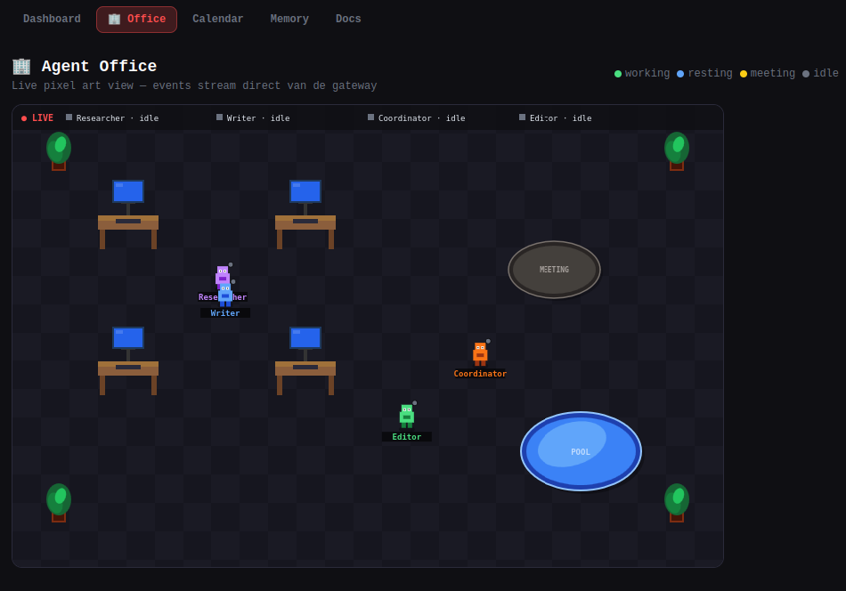

<div align="center">

# Openclaw Sandbox

**A hypervisor-isolated command center for a multi-agent AI pipeline — controlled entirely from Discord.**

*Built on [Openclaw](https://github.com/openclaw/openclaw) + [NixOS MicroVM](https://github.com/astro/microvm.nix). Declarative, reproducible, and small enough to understand.*

---

[](https://github.com/astro/microvm.nix)
[](https://github.com/cloud-hypervisor/cloud-hypervisor)
[](https://discord.com)
[](https://claude.ai)
[](LICENSE)

</div>

---

## Why This Exists

[Openclaw](https://github.com/openclaw/openclaw) is a powerful multi-agent AI platform — but it's a complex Node.js application with full system access. Running it directly on your host means trusting a large, opaque codebase with your files, credentials, and network.

This sandbox wraps Openclaw in a **NixOS MicroVM** with **cloud-hypervisor** — giving you true hypervisor-level isolation. The agent can't touch your host. It can only see what you explicitly share via virtiofs. Everything is declarative: one `flake.nix` defines the entire environment, reproducibly.

The result: Openclaw's full multi-agent power — coordinator, writer, researcher, editor — without compromising your host system.

> **Looking for a simpler single-agent setup?**
> See [nanoclaw-sandbox](https://github.com/nouwnow/nanoclaw-sandbox) — the same hypervisor isolation pattern for a lightweight Telegram bot.

---

## What You Get

<div align="center">

<p><em>Mission Control — live pixel art view of your agent team. Characters walk to their desks when working, rest at the pool when done, and show speech bubbles with what they're actually writing.</em></p>
</div>

---

**One Discord bot. A full AI team behind it.**

```
You (Discord)
    │
    ▼
@OpenClaw Agent — coordinator
    ├── 🔍 Researcher  → finds sources, facts, background
    ├── ✍️  Writer      → drafts content
    └── 🎨 Editor      → refines and finalizes
         │
         ▼
    ~/openclaw-workspace/content/
```

Each sub-agent gets its own **Discord thread** — you watch the full pipeline live as it executes. Steer agents mid-task, kill them, inspect logs — all from Discord.

**From Discord:**
```
@OpenClaw Agent write a deep-dive article on AI trends in 2026 — use the full team
@OpenClaw Agent research the top 5 competitors of [company] and make a SWOT
@OpenClaw Agent every Monday at 9:00: generate the content calendar for the week
/subagents list
/log 2
/steer 1 focus more on the European market
```

---

## Architecture

```
Host (Linux)
└── NixOS MicroVM (cloud-hypervisor, 8GB RAM, 4 vCPU)
    ├── openclaw-gateway          (port 18789) ← orchestrator: coordinator + writer + researcher + editor
    ├── openclaw-gateway-project-a (port 18790) ← project-a: coordinator-a (isolated workspace)
    ├── dashboard (Next.js)        (port 3333)  ← Mission Control web UI
    └── virtiofs mounts
        ├── /nix/store        → host Nix store (read-only)
        └── /home/agent/workspace → ~/openclaw-workspace (read-write, persistent)
```

**Multi-gateway routing:**
```
Discord / Mission Control
          │
          ▼
┌─────────────────────────┐
│  ORCHESTRATOR  (:18789) │  ← coordinator routes tasks
│  writer / researcher    │  ← content pipeline agents
│  editor                 │
└────────────┬────────────┘
             │ delegates via agentTurn
             ▼
┌─────────────────────────┐
│  PROJECT-A  (:18790)    │  ← isolated context, own memory
│  coordinator-a          │
└─────────────────────────┘
```

**Isolation model:**
- The VM runs under cloud-hypervisor — hardware-level separation from the host
- The agent user (uid 1000) can only write to the virtiofs workspace
- No SSH, no host network access beyond the tap interface
- `/nix/store` is shared read-only — no redundant downloads, fast builds

**Declarative:** The entire VM — packages, services, users, mounts — is defined in `flake.nix`. Rebuild with `nix build`. Version-locked via `flake.lock`.

---

## Requirements

- **Host OS:** Linux (Ubuntu 22.04+ / Debian 12+ / NixOS)
- **RAM:** 12 GB minimum (VM uses 8 GB by default)
- **Disk:** 20 GB free
- **KVM:** required (`/dev/kvm` accessible)
- **Nix:** with flakes enabled
- **Accounts:** [Claude Code](https://claude.ai/product/claude-code) subscription (Pro or Max), Discord account

---

## Quick Start

```bash
# 1. Clone
git clone https://github.com/nouwnow/openclaw-sandbox
cd openclaw-sandbox

# 2. Install Nix (skip if already installed)
curl -L https://nixos.org/nix/install | sh
echo "experimental-features = nix-command flakes" >> ~/.config/nix/nix.conf

# 3. KVM access
sudo usermod -aG kvm $USER  # log out and back in

# 4. Workspace
mkdir -p ~/openclaw-workspace/{.claude,.npm-global,.openclaw/agents/main/agent,.openclaw-bundled-plugins}

# 5. Create disk image for writable Nix store overlay
truncate -s 4G nix-store-rw.img
nix-shell -p e2fsprogs --run "mkfs.ext4 nix-store-rw.img"

# 6. Build the VM
nix build  # first time: 10–30 min

# 7. Network
sudo ./setup-network.sh

# 8. Start
./result/bin/virtiofsd-run   # terminal 1 — keep open
./result/bin/microvm-run     # terminal 2 — login: agent / agent
```

Then follow [OPENCLAW-SETUP.md](OPENCLAW-SETUP.md) to configure Discord and Anthropic auth.

---

## Installation

<details>
<summary>⚙️ Steps 1–4: Host preparation</summary>

### Step 1 — Host dependencies

```bash
sudo apt update && sudo apt install -y git curl iptables qemu-utils acl e2fsprogs
```

### Step 2 — Install Nix

```bash
curl -L https://nixos.org/nix/install | sh
. ~/.nix-profile/etc/profile.d/nix.sh
```

Enable flakes:
```bash
mkdir -p ~/.config/nix
echo "experimental-features = nix-command flakes" >> ~/.config/nix/nix.conf
```

### Step 3 — KVM access

```bash
sudo usermod -aG kvm $USER
# Log out and back in, then verify:
id | grep kvm
```

### Step 4 — Check UID/GID

```bash
id
# uid=1000(yourname) ...
```

If your uid/gid is **not** 1000, edit `flake.nix`:
```nix
users.groups.agent.gid = <your-gid>;
users.users.agent.uid  = <your-uid>;
```

</details>

<details>
<summary>🖥️ Steps 5–9: Build and start the VM</summary>

### Step 5 — Create workspace

```bash
mkdir -p ~/openclaw-workspace/{.claude,.npm-global,.openclaw/agents/main/agent,.openclaw-bundled-plugins}
chmod 777 ~/openclaw-workspace
```

### Step 6 — Create disk image

```bash
cd ~/openclaw-sandbox
truncate -s 4G nix-store-rw.img
nix-shell -p e2fsprogs --run "mkfs.ext4 nix-store-rw.img"
```

> The image must be formatted as ext4, not just allocated. `truncate` alone is not enough.

### Step 7 — Build the VM

```bash
nix build
```

First build: 10–30 minutes. Produces `./result/bin/microvm-run` and `./result/bin/virtiofsd-run`.

### Step 8 — Configure network

```bash
sudo ./setup-network.sh
```

> **Cold boot note:** Network settings are lost on host reboot. Always run `sudo ./setup-network.sh` before starting the VM after a reboot. See [README — Persistent network](#-persistent-network) to make this permanent.

### Step 9 — Start the VM

```bash
./result/bin/virtiofsd-run   # terminal 1 — filesystem bridge (keep open)
./result/bin/microvm-run     # terminal 2 — VM console, login: agent / agent
```

</details>

<details>
<summary>🤖 Steps 10–15: Openclaw and Discord setup</summary>

See [OPENCLAW-SETUP.md](OPENCLAW-SETUP.md) for the full step-by-step configuration.

> **Critical:** Openclaw's Anthropic plugin does **not** read `CLAUDE_CODE_OAUTH_TOKEN` from `.env`. You must create `auth-profiles.json` separately. The Discord pairing code works without this — but the agent won't actually respond to questions until it's configured. See [OPENCLAW-SETUP.md Step 4](OPENCLAW-SETUP.md#stap-4--anthropic-auth-configureren-auth-profiles).

</details>

---

## Daily Use

```bash
# Terminal 1 — filesystem bridge (keep open)
./result/bin/virtiofsd-run

# Terminal 2 — VM console
./result/bin/microvm-run
# login: agent / agent
```

Check the agent:
```bash
# In the VM
sudo systemctl status openclaw-gateway
tail -f /tmp/openclaw-gateway.log
```

---

## Multi-Agent Pipeline

Openclaw 2026.3.x has full native multi-agent support:

- **Agent bindings** — route Discord channels or DMs to specific agents
- **Subagent spawning** — coordinator spawns writer/researcher/editor as `run`-mode tasks
- **Discord thread binding** — each sub-agent automatically gets its own Discord thread via `registerDiscordSubagentHooks`
- **Live control** — `/subagents list`, `/steer <n> <msg>`, `/kill <n>`, `/log <n>` from Discord
- **Parallel broadcasting** — send one message to multiple agents simultaneously

To configure the pipeline, use Claude Code inside the VM:
```bash
cd ~/workspace && claude
```

Example:
```
Configure multi-agent orchestration in openclaw.json:
- coordinator role: main/orchestrator, listens on Discord
- writer, researcher, editor: leaf agents, local only
- enable registerDiscordSubagentHooks so each sub-agent gets its own Discord thread
```

---

## Hybride Memory & Multi-Project Orchestratie

> **Voor nieuwe gebruikers:** De standaard Openclaw-setup werkt direct en is krachtig genoeg voor de meeste use cases. De hybride memory-uitbreiding en multi-project architectuur beschreven in deze sectie zijn **gevorderd** — ze voegen significant waarde toe als je setup groeit, maar zijn niet vereist om te starten.

### Het probleem met de standaard setup

Openclaw werkt standaard met één grote memory-file (`MEMORY.md`) die bij elke sessie volledig in de context van de agent wordt geladen. Dit werkt prima voor kleine projecten, maar wordt problematisch naarmate het systeem groeit:

| Probleem | Gevolg |
|---|---|
| Alle context altijd aanwezig | Hoge tokenkosten, zelfs voor eenvoudige taken |
| Geen projectisolatie | Agent van project A "weet" alles over project B |
| Memory groeit ongecontroleerd | Agent raakt verward door irrelevante oude informatie |
| Één gateway voor alles | Downtime of herstart van één agent beïnvloedt alle projecten |

**Concreet voorbeeld van context-vervuiling:**
Je hebt een contentproject (artikelen schrijven) en een administratieproject (facturen verwerken). Zonder isolatie krijgt de schrijver-agent informatie over BTW-tarieven mee wanneer hij een artikel schrijft, en de administratie-agent leest schrijfstijlgidsen terwijl hij facturen verwerkt. Dit kost tokens en verwarrt de agent.

---

### De hybride oplossing — 4 methoden gecombineerd

We hebben vier complementaire memory-methoden geïmplementeerd die samen de standaard setup volledig vervangen:

| Methode | Type | Status | Waarde |
|---|---|---|---|
| **Folders** — `memory/projects/`, `memory/preferences/` | Markdown bestanden | ✅ Actief | Transparant, altijd beschikbaar bij sessie-start |
| **Native Memory Search** — `agents.defaults.memorySearch` | Semantische zoekopdracht via Gemini/OpenAI/Voyage embeddings | ✅ Actief | Agent zoekt zelf relevante context op via `memory_search` tool |
| **Extractie-cron** — dagelijks 23:00 | Automatische samenvatting van sessie-logs | ✅ Actief | Geen handwerk — dagelijkse feiten worden automatisch opgeslagen |
| **Facts DB** — `memory/facts.db` (SQLite) | Gestructureerde opslag voor feiten en content | ✅ Actief | Exacte queries: "welke artikelen zijn gepubliceerd?" |

De native memory search vereist een embedding API key (`GEMINI_API_KEY`, `OPENAI_API_KEY` of `VOYAGE_API_KEY`) in `.env` en deze config in `openclaw.json`:

```json
{
  "agents": {
    "defaults": {
      "memorySearch": {
        "enabled": true,
        "provider": "gemini"
      }
    }
  }
}
```

> **Belangrijk:** Configureer `memorySearch` onder `agents.defaults`, **niet** als top-level `memory.search` key — dat is een onbekende key in openclaw 2.x en laat de gateway crashen.

---

### Multi-project gateways — wanneer aanmaken?

**Maak een nieuw project aan wanneer:**

- Je twee of meer **fundamenteel verschillende domeinen** beheert (content schrijven vs. administratie)
- Je wil dat agents **nooit context delen** tussen projecten
- Je projecten onafhankelijk wil kunnen **herstarten, debuggen of uitschakelen**
- Één project veel zwaardere workloads heeft dan een ander

**Niet nodig wanneer:**
- Je meerdere taken binnen hetzelfde domein uitvoert (vijf verschillende soorten artikelen schrijven)
- Je agents onderling samenwerken aan één eindresultaat
- Je net begint — start met één gateway en splits later

**Voorbeeld waarbij projectisolatie cruciaal is:**

```
Zonder isolatie:
  Schrijver-agent ontvangt vraag: "schrijf een artikel over duurzaamheid"
  → Laadt ook context: klantfacturen, BTW-tarieven, contactgegevens
  → Hoge tokenkosten, kans op informatie-lekken, verward antwoord

Met isolatie:
  Project "content" gateway (:18790):
    → Laadt alleen: schrijfstijl, contentarchief, onderzoeksnotities
  Project "admin" gateway (:18791):
    → Laadt alleen: klantdata, factuurformaten, BTW-regels
  Orchestrator (:18789):
    → Weet van beide projecten, stuurt taakopdracht door zonder context mee te sturen
```

---

### Implementatiestappen

De volledige implementatie is uitgewerkt in **[PRD-v2-orchestrator-memory.md](PRD-v2-orchestrator-memory.md)** met 6 fases, acceptatiecriteria en exacte commando's. Samenvatting:

**Fase 1 — Memory Folders** *(15 min)*
```bash
mkdir -p .openclaw/workspace/memory/{projects,preferences}
touch .openclaw/workspace/memory/projects/{goals,decisions}.md
touch .openclaw/workspace/memory/preferences/{writing-style,tools}.md
# Voeg Memory Update Protocol toe aan AGENTS.md
```

**Fase 2 — Facts DB** *(10 min, via Claude in VM)*
```
Maak facts.db aan in .openclaw/workspace/memory/ met tabellen:
research_facts (id, topic, fact, source, confidence, created_at)
content_pieces (id, title, type, status, path, created_at, agent)
```

**Fase 3 — Extractie-cron** *(5 min)*
Voeg een cron job toe aan `jobs.json` die elke avond om 23:00 sessie-logs leest en `memory/YYYY-MM-DD.md` schrijft.

**Fase 4 — Native Memory Search** *(5 min)*
Voeg embedding API key toe aan `.env` en `memorySearch` config toe aan `openclaw.json` onder `agents.defaults`.

**Fase 5 — Project Gateway** *(30 min, vereist VM rebuild)*
Voeg `systemd.services.openclaw-gateway-project-a` toe aan `flake.nix` met eigen `stateDir` en poort.

**Fase 6 — MEM0 Plugin** *(optioneel)*
Installeer de `mem0-openclaw-mem0` plugin via de Openclaw marketplace voor volledig automatische conversatie-memory injectie.

---

### Context-isolatie in de praktijk

De orchestrator delegeert taken naar project-gateways met **minimale context** — alleen de taakomschrijving, het gewenste output-formaat, en het doelkanaal. Nooit project-specifieke bestanden of eerdere gesprekken:

```
Orchestrator stuurt naar Project-A:
  ✓ "Schrijf een artikel over zonnepanelen, max 800 woorden, voor #articles kanaal"
  ✗ Klantdata uit project B
  ✗ Gesprekslogs van de afgelopen week
  ✗ Memory bestanden van andere projecten
```

Dit betekent dat een herstart van Project-A's gateway nooit invloed heeft op de orchestrator of Project-B.

---

A fully local Next.js dashboard running inside the VM, accessible from your host browser at `http://10.0.1.2:3333`. No cloud, no external services — everything streams directly from Openclaw gateways over WebSocket and SSE.

```
Host browser  →  http://10.0.1.2:3333
                      │
              Next.js (in VM, port 3333)
                      │  WebSocket + SSE
              ┌────────────────────────┐
              │ Orchestrator  :18789   │
              │ Project-A     :18790   │  ← switchable via Projects tab
              └────────────────────────┘
```

The dashboard has **six tabs**, each auto-refreshing from live gateway events:

### Tab 1 — Dashboard

Real-time overview of everything happening right now:

- **Agents panel** — all configured agents with name and session count
- **Active sessions** — open conversations per agent with token usage and age
- **Task backlog** — all queued, running, and completed tasks; create new tasks via the form
- **Live feed** — raw gateway push events streamed via SSE as they arrive
- **Stats bar** — pending / running count and active session count at a glance

Sessions and agents refresh every 5 minutes. The live feed updates instantly via SSE.

### Tab 2 — 🏢 Office (Pixel Art)

A 2D pixel art simulation rendered on an HTML5 Canvas. Characters react to live gateway events in real time:

| Agent state | Trigger | Animation |
|---|---|---|
| Walking to desk | `agent lifecycle: phase=start` | Character moves toward its assigned desk |
| Typing at desk | Arrived at desk | Hands-on-keyboard animation, green dot |
| Speech bubble | `chat delta` event | What the agent is writing appears above its head |
| Walking to pool | `agent lifecycle: phase=end` | Character moves to pool to rest |
| Resting | At pool | Floating arm animation, blue dot |
| Error | `phase=error` | Red `!` above head, 3-second error state |
| Idle wandering | No active session | Character roams between zones |

**Gateway selector** — switch between Orchestrator and Project-A in the top bar. Each gateway shows its own agents with dynamic desk positions. Switching reconnects the SSE feed to the selected gateway. Offline gateways show a warning banner.

### Tab 3 — Projects

Overview of all configured gateways:

- **Gateway cards** — Orchestrator and all project gateways with live online/offline status (TCP port check every 30s)
- **Agent grid** — which agents exist per gateway, with their assigned color
- **Stats** — session count, port, stateDir path
- **Memory status** — shows whether memory folders and facts.db are present per gateway
- **Registry** — add new gateways by editing `.openclaw/workspace/projects.json` — no code changes needed

### Tab 4 — Calendar (Scheduled Tasks)

Visual weekly calendar for all cron jobs in `~/.openclaw/cron/jobs.json`:

- **Always Running** section — interval-based jobs (`kind: "every"`) as permanent badges
- **Weekly grid** — cron jobs plotted on the correct weekdays
- **Today highlight** — current day in red
- **Job detail modal** — agent, schedule, timezone, next/last run, error count, full prompt
- **Enable/disable** and **delete** from the modal
- **New schedule form** — create cron or interval jobs directly from the browser

The daily memory extraction cron (`memory-extractor`, runs 23:00) appears here automatically.

### Tab 5 — Memory

Three-panel memory viewer covering all four hybrid memory methods:

**🧠 Memory tab:**
- **Identity files** — `SOUL.md`, `USER.md`, `IDENTITY.md`, `HEARTBEAT.md`, `AGENTS.md`, `MEMORY.md` per agent with word count
- **Memory Folders** — collapsible categories: 🎯 Projects (`goals.md`, `decisions.md`), 🎨 Preferences (`writing-style.md`, `tools.md`), 📅 Daily Notes (auto-extracted by the 23:00 cron)
- Empty files show a placeholder — agents fill them as they work

**🗃 Facts tab:**
- **Research Facts** — browse all facts in `memory/facts.db` with topic filter chips, confidence badges (high/medium/low), and full-text search
- **Content Pieces** — all tracked content items with status (draft/review/published) and agent
- Searchable, filterable, live from SQLite via Python

**🗓 Journal tab:**
- All agent sessions grouped by date, newest first
- Days with an extracted memory note show ✅ badge and "extracted" label
- Green "Last extraction: YYYY-MM-DD" banner when extraction cron has run
- Click a day → see all sessions; click a session → full conversation view

**Global search** — type in the search bar (min. 2 chars) to search across all memory sources simultaneously: identity files, memory folders, facts DB, and daily notes. Results show source type, snippet with match highlighted in yellow, and click-to-open.

### Tab 6 — Docs

Document viewer for all files the agents have created:

- **Category filter chips** — `articles`, `newsletters`, `research`, `scripts`, `other`
- **Full-text search** — title, slug, agent, date
- **File list** — sorted by date, with category badge, size, word count
- **Rendered markdown** — headers, bold, lists, code, blockquotes

Agents save output to `~/workspace/content/{category}/YYYY-MM-DD_{agent}_{slug}.md`.

---

### Setup

The dashboard is a Next.js app located in `~/workspace/dashboard/`. It is configured as a **systemd service** in `flake.nix` and starts automatically with the VM — no manual steps needed after a `nix build`.

**First-time setup (in the VM):**
```bash
cd ~/workspace/dashboard
npm install
```

**After `nix build` + VM restart:** the dashboard builds and starts automatically. Available at `http://10.0.1.2:3333`.

**Check status:**
```bash
sudo systemctl status openclaw-dashboard
sudo journalctl -u openclaw-dashboard -f
```

> **Build time:** the systemd service runs `npm run build` on every start/restart (~15–20 seconds). The dashboard is only available after the build completes.

**Manual restart:**
```bash
sudo systemctl restart openclaw-dashboard
```

---

### NixOS + VM Challenges and Solutions

Running a Next.js app inside a NixOS MicroVM requires solving several non-obvious problems. These are all already solved in this repo — documented here so you understand why the config looks the way it does.

<details>
<summary><strong>1. systemd service fails with <code>spawn sh ENOENT</code></strong></summary>

**Problem:** `npm run build` in a systemd service immediately fails. `npm` runs scripts by invoking `sh` internally, but NixOS systemd services get a minimal `PATH` with no `/bin/sh`.

**Solution:** Add `path = [ pkgs.bash pkgs.nodejs_20 pkgs.coreutils ]` to the service definition in `flake.nix`. This puts bash, node, and standard tools in the service's `PATH`.

```nix
systemd.services.openclaw-dashboard = {
  path = [ pkgs.bash pkgs.nodejs_20 pkgs.coreutils ];
  ...
};
```

</details>

<details>
<summary><strong>2. Firewall blocks port 3333 — browser can't connect</strong></summary>

**Problem:** The Next.js server binds on `0.0.0.0:3333` inside the VM, but the NixOS firewall drops incoming packets from the host. `http://10.0.1.2:3333` times out in the browser.

**Solution:** Add port 3333 to `networking.firewall.allowedTCPPorts` in `flake.nix`. Already done.

**Quick fix without rebuild:**
```bash
sudo iptables -I INPUT -p tcp --dport 3333 -j ACCEPT
```

</details>

<details>
<summary><strong>3. Gateway WebSocket protocol — 8 non-obvious requirements</strong></summary>

The Openclaw gateway uses a custom WebSocket protocol. None of this is documented publicly — it was reverse-engineered from the minified source in the Nix store.

| Requirement | What happens if you get it wrong |
|---|---|
| Wait for `connect.challenge` before sending `connect` | Gateway closes silently |
| Include `"type": "req"` in every request frame | `1008 invalid request frame` |
| Use `client.id = "openclaw-control-ui"` | All scopes are cleared → `missing scope: operator.read` |
| Include `Origin: http://127.0.0.1:3333` header | `origin missing or invalid` |
| Set `dangerouslyDisableDeviceAuth: true` in `openclaw.json` | Ed25519 keypair required → connection refused |
| Auth is plain token: `auth: { token: "..." }` | Trying HMAC causes auth failure |
| Response data is in `payload`, not `result` | Silent empty responses |
| `agents.list` / `sessions.list` return wrapper objects | Panels show 0 items despite 200 OK |

All of these are solved in `src/lib/gateway.ts`.

</details>

<details>
<summary><strong>4. <code>tasks.list</code> does not exist in the gateway</strong></summary>

**Problem:** The gateway has no `tasks.list` RPC method. Calling it returns `unknown method: tasks.list`.

**Solution:** Tasks are stored locally in `~/.openclaw/tasks.json` and read/written directly by the Next.js API routes — no gateway needed.

</details>

<details>
<summary><strong>5. <code>ws</code> package requires <code>serverExternalPackages</code></strong></summary>

**Problem:** Next.js on Node.js 20+ tries to bundle the `ws` WebSocket package. This breaks at runtime with `bufferutil.mask is not a function`.

**Solution:** Add to `next.config.js`:
```js
serverExternalPackages: ['ws', 'bufferutil', 'utf-8-validate']
```

</details>

<details>
<summary><strong>6. Agent memory is UUID-based, not date-based</strong></summary>

**Problem:** Openclaw session files are named by UUID (`3759cfbe-....jsonl`), not by date. There is no `sessions.list` gateway method that returns dates.

**Solution:** The memory API reads the first line of each `.jsonl` file to extract the `timestamp` field, then groups sessions by date client-side.

</details>

---

### Gateway Push Events (for the Pixel Art Office)

The office simulation is driven by live WebSocket events. Key event types:

```javascript
// Agent starts working → walk to desk
{ event: 'agent', payload: { stream: 'lifecycle', data: { phase: 'start' }, sessionKey: 'agent:coordinator:...' }}

// Agent writing → speech bubble
{ event: 'agent', payload: { stream: 'assistant', data: { delta: '...', text: '...' }, sessionKey: '...' }}

// Agent done → walk to pool
{ event: 'agent', payload: { stream: 'lifecycle', data: { phase: 'end' }, sessionKey: '...' }}

// Cron job fired → coordinator goes to work
{ event: 'cron', payload: { action: 'started', jobId: '...' }}
```

Extract `agentId` from `sessionKey`: `'agent:coordinator:cron:...'` → `split(':')[1]` → `'coordinator'`

See [OPENCLAW-SETUP.md — Stap 9](OPENCLAW-SETUP.md) for the full gateway protocol reference.

---

## Configuration

### Resource scaling

```nix
# flake.nix
microvm = {
  mem  = 8192;   # 8 GB  — default
  # mem = 16384; # 16 GB — for heavy swarm pipelines
  vcpu = 4;
  # vcpu = 8;    # for parallel agent execution
};
```

### Mount additional directories

```nix
{ source = "/home/youruser/projects";
  mountPoint = "/home/agent/projects";
  tag = "projects";
  proto = "virtiofs"; }
```

### After `nix build` upgrades

The Nix store hash changes with each upgrade. Regenerate the plugin overlay:

```bash
# On the host:
~/openclaw-sandbox/build-plugin-overlay.sh

# Then in the VM:
sudo systemctl restart openclaw-gateway
```

---

## Persistent Network

After a host reboot, the tap interface is gone. To make it permanent:

**`/etc/systemd/network/10-vmtap1.netdev`:**
```ini
[NetDev]
Name=vmtap1
Kind=tap

[Tap]
User=youruser
```

**`/etc/systemd/network/10-vmtap1.network`:**
```ini
[Match]
Name=vmtap1

[Network]
Address=10.0.1.1/24
IPMasquerade=ipv4
IPForward=yes
```

```bash
sudo systemctl enable --now systemd-networkd
sudo systemctl restart systemd-networkd
```

---

## Project Structure

```
openclaw-sandbox/
├── flake.nix                     # Complete VM definition (gateways, dashboard, firewall)
├── flake.lock                    # Pinned dependency versions
├── setup-network.sh              # Host network setup (vmtap1 + NAT)
├── build-plugin-overlay.sh       # Rebuild plugin overlay after nix build upgrades
├── nix-store-rw.img              # Writable ext4 overlay for /nix/store in VM
├── README.md                     # This file
├── OPENCLAW-SETUP.md             # Openclaw + Discord + multi-agent setup guide
└── PRD-v2-orchestrator-memory.md # Full PRD: multi-project + hybrid memory (6 phases)

~/openclaw-workspace/             # Persistent state (virtiofs, survives VM reboots)
├── .claude/                      # Claude Code auth
├── .npm-global/                  # Global npm packages incl. claude binary
├── .env                          # Secrets: Discord token, API keys (Gemini/OpenAI)
├── .openclaw/                    # Orchestrator gateway state (port 18789)
│   ├── agents/*/sessions/        # JSONL session logs per agent
│   ├── cron/jobs.json            # Scheduled tasks incl. memory-extractor (23:00)
│   └── workspace/
│       ├── SOUL.md / USER.md / IDENTITY.md / AGENTS.md
│       ├── MEMORY.md             # Curated long-term memory
│       ├── projects.json         # Gateway registry for Mission Control
│       └── memory/               # Hybrid memory store
│           ├── YYYY-MM-DD.md     # Daily extraction notes (auto-generated)
│           ├── projects/
│           │   ├── goals.md
│           │   └── decisions.md
│           ├── preferences/
│           │   ├── writing-style.md
│           │   └── tools.md
│           └── facts.db          # SQLite: research_facts + content_pieces
├── project-a/                    # Project-A gateway (port 18790)
│   └── .openclaw/
│       ├── openclaw.json         # coordinator-a config, port 18790
│       └── workspace/
│           ├── SOUL.md / USER.md
│           └── memory/           # Isolated memory — never mixed with orchestrator
├── .openclaw-bundled-plugins/    # Plugin overlay (74 plugins, workaround for Nix)
├── content/                      # Agent output — files written by the pipeline
└── dashboard/                    # Mission Control (Next.js, port 3333)
    ├── src/app/                  # Pages: / /office /projects /schedules /memory /docs
    ├── src/app/api/feed/         # SSE stream with ?port= gateway selector
    ├── src/app/api/projects/     # Gateway registry + live TCP port checks
    ├── src/app/api/memory/       # Sessions, markdown files, folder browser
    ├── src/app/api/memory/facts/ # SQLite facts.db via Python sqlite3
    ├── src/app/api/memory/search/# Full-text search across all memory sources
    ├── src/app/api/schedules/    # CRUD for cron jobs.json
    ├── src/app/api/docs/         # Content file browser
    └── src/lib/gateway.ts        # WebSocket client (challenge-response protocol)
```

---

## Troubleshooting

<details>
<summary>Bot connects but doesn't respond to questions</summary>

The Discord pairing flow is built into the gateway and works without Anthropic auth. Actual AI responses require `auth-profiles.json`:

```bash
cat ~/openclaw-workspace/.openclaw/agents/main/agent/auth-profiles.json
```

Missing? See [OPENCLAW-SETUP.md Step 4](OPENCLAW-SETUP.md).

</details>

<details>
<summary>Bot ignores messages in server channels</summary>

In server channels, the bot only responds to @mentions:
```
@OpenClaw Agent hello
```

In DMs, no mention is needed.

</details>

<details>
<summary>Plugin manifests not found (0 plugins loaded)</summary>

```bash
ls ~/openclaw-workspace/.openclaw-bundled-plugins/ | wc -l  # should be ~74
~/openclaw-sandbox/build-plugin-overlay.sh
# then in the VM:
sudo systemctl restart openclaw-gateway
```

</details>

<details>
<summary>virtiofs: EPERM on write to workspace</summary>

UID/GID mismatch. Check with `id` on the host and ensure `users.users.agent.uid` and `users.groups.agent.gid` in `flake.nix` match your host uid/gid (default 1000).

</details>

<details>
<summary>cloud-hypervisor: "Failed connecting backend"</summary>

virtiofsd was not started before the VM. Always start `virtiofsd-run` first, then `microvm-run`.

</details>

<details>
<summary>Network not working in VM</summary>

```bash
# In the VM:
ping 8.8.8.8
# Not reachable? On the host:
sudo ~/openclaw-sandbox/setup-network.sh
```

</details>

<details>
<summary>Dashboard shows "Gateway connection closed" or 500 errors</summary>

The gateway requires a specific connection handshake. Common causes:

- **Wrong `client.id`** — must be `"openclaw-control-ui"` (not `"gateway-client"` or `"cli"`)
- **Missing `type: "req"`** — every request frame must include this field
- **`connect` sent before challenge** — wait for `connect.challenge` event before sending `connect`
- **Missing `dangerouslyDisableDeviceAuth`** — without this in `openclaw.json`, the gateway clears all scopes for clients without an Ed25519 device keypair, causing `missing scope: operator.read`
- **Wrong `GATEWAY_URL`** — inside the VM use `ws://127.0.0.1:18789`; from the host use `ws://10.0.1.2:18789`

See [OPENCLAW-SETUP.md — Stap 9](OPENCLAW-SETUP.md) for the full protocol and config.

</details>

<details>
<summary>Dashboard agents/sessions panel shows 0 items despite 200 OK</summary>

The gateway wraps list results in an object: `agents.list` returns `{ agents: [...], defaultId, ... }` and `sessions.list` returns `{ sessions: [...], count, ... }`. The API routes must extract the nested array, not return the wrapper object directly.

</details>

<details>
<summary>Gateway crashes with "Unrecognized key: search" after adding memory config</summary>

The `memory.search` key at the top level of `openclaw.json` is not supported in openclaw 2.x. Configure memory search under `agents.defaults` instead:

```json
{
  "agents": {
    "defaults": {
      "memorySearch": {
        "enabled": true,
        "provider": "gemini"
      }
    }
  }
}
```

If the gateway is already in a crash loop, run `openclaw doctor --fix` inside the VM to remove invalid keys, then restart:
```bash
cd /home/agent/workspace/.openclaw && openclaw doctor --fix
sudo systemctl restart openclaw-gateway
```

</details>

<details>
<summary>Claude Code re-asks for login after reboot</summary>

```bash
# In the VM, after first login:
cp ~/.claude.json ~/workspace/.claude.json
```

The symlink is already configured in `flake.nix` — this only needs to be done once.

</details>

---

## FAQ

**Why NixOS MicroVM instead of Docker?**

Docker provides process-level isolation. A MicroVM provides hypervisor-level isolation — the agent runs in a separate kernel with its own memory space. There's no shared kernel, no escape via kernel vulnerabilities, and no host process namespace access. For an application with full system capabilities like Openclaw, this matters.

**Why Openclaw instead of building your own?**

Openclaw provides multi-agent orchestration, Discord/Telegram/WhatsApp channels, scheduling, memory, and tooling that would take months to build. This sandbox provides the isolation layer that makes running it safe.

**Does this work with a Claude API key instead of a subscription?**

Yes. Replace the OAuth token in `auth-profiles.json` with:
```json
{
  "version": 1,
  "profiles": {
    "anthropic:default": {
      "type": "apiKey",
      "provider": "anthropic",
      "token": "sk-ant-api03-..."
    }
  }
}
```

**How do I update Openclaw?**

Edit the `nix-openclaw` input in `flake.nix`, run `nix flake update`, then `nix build`. After the build, regenerate the plugin overlay with `build-plugin-overlay.sh`.

**Can I run this alongside nanoclaw-sandbox?**

Yes. They use different subnets (nanoclaw: `10.0.0.x`, openclaw: `10.0.1.x`), different tap interfaces (`vmtap0` / `vmtap1`), and different vsock CIDs. They can run in parallel.

---

## Related Projects

| Project | Description |
|---------|-------------|
| [nanoclaw-sandbox](https://github.com/nouwnow/nanoclaw-sandbox) | Single-agent Telegram bot — same hypervisor isolation, simpler setup |
| [openclaw/openclaw](https://github.com/openclaw/openclaw) | The Openclaw platform this sandbox runs |
| [astro/microvm.nix](https://github.com/astro/microvm.nix) | NixOS MicroVM framework |

---

## License

MIT
